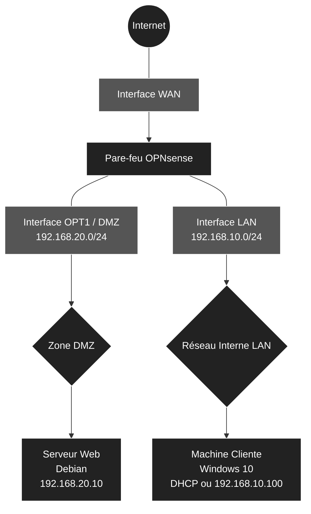

# 🛡️ Infrastructure Réseau, Sécurité et Segmentation

<br>


# 1.Architecture et Adressage IP

<br>

## 1.1 Schéma d'Architecture
Voici l'architecture logique de notre infrastructure, séparée en deux zones distinctes (LAN et DMZ) pour isoler le serveur Web accessible depuis l'extérieur.



<br>

## 1.2 Plan d'Adressage IP et Dimensionnement

<br>

| Rôle VM | Système | vCPU | RAM | Disque | Interfaces | Réseaux Virtuels | Adresses IP |
| :--- | :--- | :---: | :---: | :---: | :--- | :--- | :--- |
| **Pare-feu** | OPNsense | 1 | 1-2 Go | 20 Go | WAN (em0), LAN (em1), DMZ (em2) | **VMnet8** (NAT), **VMnet10** (Host-only), **VMnet20** (Host-only) | DHCP, `192.168.10.1/24`, `192.168.20.1/24` |
| **Serveur Web** | Debian 12 | 1 | 1-2 Go | 25 Go | eth0 | **VMnet20** (DMZ) | `192.168.20.10/24` (Statique) |
| **Client** | Windows 10 | 4 | 4-6 Go | 40 Go | Ethernet0 | **VMnet10** (LAN) | DHCP OPNsense (`192.168.10.x`) |

<br>

# 📋 Plan de Déploiement : Infrastructure Réseau et Sécurité sous VMware

Ce document détaille les étapes de construction de l'infrastructure virtuelle comprenant un pare-feu (OPNsense), un réseau interne (LAN) avec un poste client, et une zone démilitarisée (DMZ) hébergeant un serveur Web.

<br>

## 🛠️ Phase 1 : Préparation des réseaux virtuels (Virtual Network Editor)

La toute première étape consiste à préparer le "câblage" virtuel dans VMware avant même de créer les machines.
- **WAN (VMnet8 - NAT) :** Vérification du réseau par défaut permettant au pare-feu d'accéder à Internet.
- **LAN (VMnet10 - Host-only) :** Création du commutateur virtuel pour le réseau interne, en désactivant le DHCP natif de VMware (car OPNsense s'en chargera).
- **DMZ (VMnet20 - Host-only) :** Création du commutateur virtuel pour la zone publique isolée, en désactivant également le DHCP de VMware.

<br>

## 🖥️ Phase 2 : Création des Machines Virtuelles (Coquilles vides)

Nous allons paramétrer les trois machines selon le tableau de dimensionnement défini dans l'architecture.
- **Pare-feu OPNsense :** 1 vCPU, 2 Go RAM, 20 Go Disque. Ajout strict des 3 cartes réseau dans le bon ordre pour simplifier la configuration : WAN (VMnet8) en premier, LAN (VMnet10) en deuxième, DMZ (VMnet20) en troisième.
- **Serveur Web (Debian 12) :** 1 vCPU, 2 Go RAM, 25 Go Disque. Ajout d'une seule carte réseau assignée à la DMZ (VMnet20).
- **Client (Windows 10) :** 4 vCPU, 6 Go RAM, 40 Go Disque. Ajout d'une seule carte réseau assignée au LAN (VMnet10).

<br>

## 🔥 Phase 3 : Installation et Configuration initiale d'OPNsense (Console)

Déploiement du routeur central de notre infrastructure.
- Installation de l'OS OPNsense depuis l'ISO.
- Assignation des interfaces physiques virtuelles (`em0`, `em1`, `em2`) à leurs rôles respectifs (WAN, LAN, OPT1/DMZ).
- Configuration des adresses IP statiques depuis la console pour le LAN (`192.168.10.1/24`) et la DMZ (`192.168.20.1/24`).
- Activation du serveur DHCP sur l'interface LAN pour distribuer des IP aux futurs clients.

<br>

## 💻 Phase 4 : Déploiement de la Machine Cliente (Windows 10)

Mise en place du poste utilisateur dans le réseau interne, qui servira aussi de poste d'administration.
- Installation de Windows 10.
- Vérification de la bonne récupération de l'adresse IP (`192.168.10.x`) via le DHCP d'OPNsense.
- Accès à l'interface graphique web (WebGUI) d'OPNsense depuis le navigateur du client.

<br>

## 🌐 Phase 5 : Déploiement du Serveur Web (Debian 12)

Mise en place du serveur dans la zone isolée.
- Installation de Debian 12 (sans interface graphique pour plus de légèreté).
- Configuration réseau en IP statique (`192.168.20.10`, passerelle `192.168.20.1`, DNS).
- Installation du service Web (Nginx ou Apache) et création d'une page d'accueil HTML personnalisée de test.

<br>

## 🛡️ Phase 6 : Règles de Pare-feu et Routage (Interface Web OPNsense)

Sécurisation des flux réseau depuis l'interface graphique d'OPNsense.
- **Règles LAN :** Autoriser le réseau interne à accéder à Internet et à la DMZ.
- **Règles DMZ :** Isoler le serveur Web (bloquer les connexions initiées depuis la DMZ vers le LAN, mais autoriser l'accès à Internet pour les mises à jour Debian).
- **NAT (Port Forwarding) :** Rediriger le trafic entrant (depuis le réseau WAN) sur le port 80 vers l'IP du serveur Debian (`192.168.20.10`) pour simuler un accès depuis l'extérieur.

<br>

## ✅ Phase 7 : Tests de validation finaux

Vérification de la conformité et de l'étanchéité de l'architecture.
- **Test d'accès :** Accès à la page web de la Debian depuis le client Windows (doit réussir).
- **Test d'isolation :** Ping depuis la machine Debian vers la machine Windows (doit être bloqué par les règles de la DMZ).
- **Test d'accès externe (NAT) :** Accès au serveur Web depuis la machine hôte physique (ton PC) via l'IP WAN d'OPNsense.

<br>

## 🛠️ Phase 1 : Préparation des réseaux virtuels (VMware)

Avant de créer les machines virtuelles, il faut configurer les commutateurs virtuels (Virtual Switches) qui vont relier nos différentes zones. Dans VMware Workstation, cela se gère via le **Virtual Network Editor**.

<br>

### 1. Ouverture du Virtual Network Editor

1. Lance **VMware Workstation**.
2. Dans le menu du haut, clique sur **Edit** > **Virtual Network Editor...**.
3. *Important :* Si les paramètres sont grisés, clique sur le bouton **Change Settings** en bas à droite (avec le bouclier Administrateur) et valide l'invite de contrôle de compte d'utilisateur de Windows.

<br>

### 2. Vérification du réseau WAN (VMnet8)

Ce réseau existe déjà par défaut, c'est lui qui donnera accès à Internet à ton pare-feu OPNsense.

1. Dans la liste des réseaux en haut, repère **VMnet8**.
2. Vérifie que la colonne *Type* indique bien **NAT**.
3. Assure-toi que les cases **Connect a host virtual adapter to this network** et **Use local DHCP service to distribute IP address to VMs** sont **cochées**.
4. Laisse le *Subnet IP* par défaut (il varie selon ton installation VMware, ce n'est pas gênant).

<br>

### 3. Création du réseau LAN (VMnet10)

Nous créons ici le réseau interne pour ton client Windows. Ce réseau doit être isolé et c'est OPNsense qui distribuera les adresses IP, il faut donc désactiver le DHCP de VMware.

1. Clique sur le bouton **Add Network...** en bas à droite.
2. Dans le menu déroulant, choisis **VMnet10** et clique sur **OK**.
3. Sélectionne **VMnet10** dans la liste, puis configure-le exactement comme ceci :
   - **Type :** Sélectionne **Host-only** (Connect VMs internally in a private network).
   - **Connect a host virtual adapter... :** Tu peux laisser coché (cela permet à ton PC physique de communiquer avec le LAN).
   - **Use local DHCP service... :** ❌ **DÉCOCHE IMPÉRATIVEMENT CETTE CASE** (notre OPNsense fera office de serveur DHCP).
   - **Subnet IP :** Saisis `192.168.10.0`
   - **Subnet mask :** Saisis `255.255.255.0`

<br>

### 4. Création du réseau DMZ (VMnet20)

Nous créons ici la zone publique isolée pour ton serveur Web Debian.

1. Clique à nouveau sur **Add Network...**.
2. Choisis **VMnet20** et clique sur **OK**.
3. Sélectionne **VMnet20** dans la liste, puis configure-le :
   - **Type :** Sélectionne **Host-only**.
   - **Connect a host virtual adapter... :** Laisse coché.
   - **Use local DHCP service... :** ❌ **DÉCOCHE IMPÉRATIVEMENT CETTE CASE** (le serveur Web aura une IP statique).
   - **Subnet IP :** Saisis `192.168.20.0`
   - **Subnet mask :** Saisis `255.255.255.0`

<br>

### 5. Validation

1. Clique sur le bouton **Apply** en bas à droite (VMware va redémarrer ses services réseau, cela prend quelques secondes).
2. Clique sur **OK** pour fermer la fenêtre.

Le câblage virtuel est maintenant prêt !

<br>

## 🖥️ Phase 2 : Création des Machines Virtuelles

Dans cette étape, nous allons créer les trois machines. Pour OPNsense et Windows, nous utiliserons la détection automatique de l'ISO. Pour Debian, suite à une limitation de l'assistant, nous créerons la machine à vide avant d'y lier l'ISO. **Attention : ne démarre aucune VM à la fin de l'assistant**, nous devons d'abord ajuster le matériel et le réseau.

<br>

### 1. Création de la VM Pare-feu (OPNsense)

1. Dans VMware, clique sur **File** > **New Virtual Machine...** > **Typical (recommended)**.
2. Choisis **Installer disc image file (iso)** et pointe vers l'ISO d'OPNsense (VMware détectera FreeBSD).
3. **Name :** Nomme la machine `OPNsense-Firewall`.
4. **Disk :** Saisis **20 GB** (*Store virtual disk as a single file*).
5. **Ready to Create :** ❌ **Décoche la case "Power on this virtual machine after creation"** puis clique sur **Finish**.

**Configuration stricte du matériel et des cartes réseau :**
Fais un clic droit sur la VM `OPNsense-Firewall` > **Settings...**
- **Mémoire (RAM) :** Ajuste à `2048` MB (2 Go).
- **Processeurs :** Ajuste à `1`.
- **Réseau 1 (WAN) :** Sélectionne la carte `Network Adapter` existante et vérifie qu'elle est sur **NAT (VMnet8)**.
- **Réseau 2 (LAN) :** Clique sur **Add...** > **Network Adapter** > **Finish**. Sélectionne cette 2ème carte, coche **Custom: Specific virtual network** > choisis **VMnet10**.
- **Réseau 3 (DMZ) :** Clique sur **Add...** > **Network Adapter** > **Finish**. Sélectionne cette 3ème carte, coche **Custom: Specific virtual network** > choisis **VMnet20**.
- Clique sur **OK**.

<br>

### 2. Création de la VM Serveur Web (Debian 12/13)

Cette machine sera isolée dans la zone démilitarisée (DMZ). L'ISO n'étant pas reconnu par l'assistant, nous la configurons manuellement.

1. Relance l'assistant : **File** > **New Virtual Machine...** > **Typical (recommended)**.
2. Choisis **I will install the operating system later** et clique sur **Next**.
3. **Guest Operating System :** Choisis **Linux**, puis dans la liste déroulante, sélectionne **Debian 12.x 64-bit** (ou Debian 13.x 64-bit si disponible).
4. **Name :** Nomme la machine `Serveur-Web-Debian`.
5. **Disk :** Saisis **25 GB** (*Store virtual disk as a single file*). Clique sur **Next** puis sur **Finish**.

**Configuration du matériel, du réseau DMZ et de l'ISO :**
Fais un clic droit sur la VM `Serveur-Web-Debian` > **Settings...**
- **Mémoire (RAM) :** Ajuste à `2048` MB (2 Go).
- **Processeurs :** Ajuste à `1`.
- **Réseau (DMZ) :** Sélectionne la carte `Network Adapter`, coche **Custom: Specific virtual network** > choisis **VMnet20**.
- **CD/DVD (IDE) :** Sélectionne ce composant, coche **Use ISO image file**, clique sur **Browse...** et pointe vers ton fichier ISO Debian.
- Clique sur **OK**.

<br>

### 3. Création de la VM Client (Windows 10)

Cette machine sera dans le réseau interne (LAN).

1. Relance l'assistant : **File** > **New Virtual Machine...** > **Typical (recommended)**.
2. Choisis **Installer disc image file (iso)** et pointe vers l'ISO de Windows 10.
3. Pas besoin de **clés d'activation et de mot de passe il faut juste sélectionner la version Windows 10 Pro et saisir un nom**.
4. **Name :** Nomme la machine `Client-Windows10`.
5. **Disk :** Saisis **60 GB** (*Store virtual disk as a single file*).
6. **Ready to Create :** ❌ **Décoche la case "Power on this virtual machine after creation"** puis clique sur **Finish**.

**Configuration du matériel et du réseau LAN :**
Fais un clic droit sur la VM `Client-Windows10` > **Settings...**
- **Mémoire (RAM) :** Ajuste à `6144` MB (6 Go).
- **Processeurs :** Ajuste à `4`.
- **Réseau (LAN) :** Sélectionne la carte `Network Adapter`, coche **Custom: Specific virtual network** > choisis **VMnet10**.
- Clique sur **OK**.

<br>

## 🔥 Phase 3 : Installation et Configuration initiale d'OPNsense (Console)

Il est temps de donner vie à notre routeur central. Nous allons installer le système d'exploitation OPNsense sur la machine virtuelle, puis lui attribuer ses adresses IP de base pour le LAN et la DMZ via la ligne de commande.

<br>

### 1. Installation du système OPNsense

1. Dans VMware, sélectionne la VM `OPNsense-Firewall` et clique sur **Power on this virtual machine**.
2. Laisse le système démarrer (des lignes de texte vont défiler) jusqu'à arriver sur une invite de connexion (`login:`).
3. Connecte-toi avec les identifiants par défaut du LiveCD :
   - **Login :** `installer`
   - **Password :** `opnsense` *(Attention, le clavier est en QWERTY par défaut, tape donc `opnsense`)*.
4. L'assistant d'installation s'ouvre (utilise les flèches directionnelles et la touche Entrée) :
   - **Keymap :** Laisse sur *Accept these Settings* (ou cherche `fr.kbd` pour le clavier français si tu préfères).
   - **Task :** Choisis **Install (UFS)** et valide.
   - **Disk :** Sélectionne ton disque virtuel (généralement nommé `da0` ou `vtbd0`) et valide par **YES** pour effacer les données.
   - Laisse l'installation se terminer (cela prend environ 2 à 3 minutes).
5. À la fin, l'assistant te propose de redémarrer (Reboot). **Avant de valider**, il faut éjecter l'ISO pour éviter de relancer l'installation : 
   - Fais un clic droit sur l'onglet de la VM OPNsense en haut > **Settings** > **CD/DVD** > décoche **Connect at power on**. Clique sur **OK**.
6. Valide maintenant le **Reboot** dans la console OPNsense.

<br>

### 2. Assignation des cartes réseau

Après le redémarrage, OPNsense t'accueille avec un menu de configuration (options 0 à 13) et affiche l'assignation actuelle des cartes. Par défaut, FreeBSD nomme tes cartes `em0`, `em1` et `em2`. Il faut s'assurer qu'elles sont dans le bon ordre.

1. Connecte-toi avec les identifiants root fraîchement installés :
   - **Login :** `root`
   - **Password :** `opnsense`
2. Tape l'option **1** (Assign Interfaces) et valide par Entrée :
   - *Do you want to configure LAGGs?* -> Tape **N** et valide.
   - *Do you want to configure VLANs?* -> Tape **N** et valide.
   - *Enter the WAN interface name:* -> Tape `em0`.
   - *Enter the LAN interface name:* -> Tape `em1`.
   - *Enter the Optional 1 interface name:* -> Tape `em2` (C'est notre DMZ).
   - Laisse vide la ligne suivante et fais **Entrée** pour terminer l'assignation.
   - *Do you want to proceed?* -> Tape **y** (Yes).

<br>

### 3. Configuration des adresses IP (LAN et DMZ)

Le système va recharger les interfaces. Nous allons maintenant appliquer ton plan d'adressage IP.

**A. Configuration du LAN (VMnet10) :**
1. Dans le menu principal, tape **2** (Set interface IP address).
2. Sélectionne l'interface **LAN** (tape le numéro correspondant, généralement `2`).
3. *Configure IPv4 address LAN interface via DHCP?* -> **n** (Non).
4. *Enter the new LAN IPv4 address:* -> Tape `192.168.10.1`
5. *Enter the new LAN IPv4 subnet bit count:* -> Tape `24`
6. *For a WAN, enter the new LAN IPv4 upstream gateway...* -> Fais simplement **Entrée** (on laisse vide pour le LAN).
7. *Configure IPv6 address LAN interface via DHCP6?* -> **n** (Fais Entrée pour ignorer la configuration IPv6).
8. *Do you want to enable the DHCP server on LAN?* -> **y** (Oui).
9. *Enter the start address of the IPv4 client address range:* -> `192.168.10.100`
10. *Enter the end address:* -> `192.168.10.150`
11. *Do you want to change the web GUI protocol from HTTPS to HTTP?* -> **n** (Non, on garde le HTTPS sécurisé).

**B. Configuration de la DMZ (OPT1 - VMnet20) :**
1. De retour au menu, tape à nouveau **2** (Set interface IP address).
2. Sélectionne l'interface **OPT1** (généralement `3`).
3. *Configure IPv4 address OPT1 interface via DHCP?* -> **n**.
4. *Enter the new OPT1 IPv4 address:* -> Tape `192.168.20.1`
5. *Enter the new OPT1 IPv4 subnet bit count:* -> Tape `24`
6. *Gateway:* -> Fais **Entrée**.
7. *IPv6:* -> **n** puis Entrée pour ignorer.
8. *Do you want to enable the DHCP server on OPT1?* -> **n** (Non, notre serveur Debian sera configuré en IP statique).

Laisse le routeur appliquer les paramètres. Le haut de ton menu devrait maintenant afficher fièrement :
- **WAN** (em0) : *Une adresse IP distribuée par le NAT de ton VMware (ex: 192.168.x.x)*
- **LAN** (em1) : `192.168.10.1/24`
- **OPT1** (em2) : `192.168.20.1/24`

<br>

## 💻 Phase 4 : Déploiement du Client (Windows 10) et Accès Web OPNsense

Cette machine, située dans le réseau interne (LAN), va récupérer une adresse IP automatiquement via le pare-feu et nous servira de poste d'administration graphique.

<br>

### 1. Installation de Windows 10

1. Dans VMware, sélectionne la VM `Client-Windows10` et clique sur **Power on this virtual machine**.
2. Appuie sur une touche au démarrage pour booter sur l'ISO.
3. Suis l'assistant d'installation standard de Windows :
   - Choisis **Je n'ai pas de clé de produit**.
   - Sélectionne **Windows 10 Pro**.
   - Choisis l'installation **Personnalisée** et sélectionne le disque de 40 Go.
4. Lors de la configuration initiale (OOBE), sélectionne une configuration pour un usage personnel et crée un compte local hors ligne (sans compte Microsoft) pour gagner du temps.

<br>

### 2. Vérification de l'adressage IP (DHCP)

Une fois sur le bureau Windows, nous allons vérifier que la machine communique bien avec OPNsense.

1. Fais un clic droit sur le bouton Démarrer de Windows > **Windows PowerShell** (ou Invite de commandes).
2. Tape la commande `ipconfig` et valide par Entrée.
3. Vérifie les informations de la carte Ethernet (qui correspond physiquement à ton VMnet10) :
   - **Adresse IPv4 :** Tu dois avoir une IP dans la plage définie à la Phase 3 (par exemple `192.168.10.100`).
   - **Passerelle par défaut :** Tu dois voir l'IP de ton pare-feu `192.168.10.1`.
   - *Test optionnel :* Tape `ping 8.8.8.8` pour vérifier que ton client a bien accès à Internet à travers OPNsense.

<br>

### 3. Premier accès à l'interface Web d'OPNsense (WebGUI)

Maintenant que la machine cliente est correctement adressée sur le LAN, elle peut administrer le pare-feu.

1. Ouvre le navigateur Microsoft Edge sur la machine Windows 10.
2. Dans la barre d'adresse, tape `https://192.168.10.1` et fais Entrée.
3. Un avertissement de sécurité s'affiche car le certificat SSL est auto-signé. Clique sur **Paramètres avancés** (ou *Advanced*), puis sur **Continuer vers 192.168.10.1 (dangereux)**.
4. Connecte-toi avec les identifiants par défaut définis à la Phase 3 :
   - **Utilisateur :** `root`
   - **Mot de passe :** `opnsense` (ou autre si vous avez changer le mot de passe à la fin de l'installation de opnsesense).

<br>

### 4. Assistant de configuration initiale OPNsense (Wizard)

Un assistant de premier démarrage (*Wizard*) se lance automatiquement dès ta première connexion. Clique sur **Next** pour parcourir les étapes :

- **General Information :** 
  - *Hostname:* Laisse `OPNsense` (ou change-le à ta guise).
  - *Domain:* Laisse `localdomain`.
  - *Primary DNS Server:* Tu peux saisir `8.8.8.8` (ou laisser vide pour hériter de la configuration du réseau NAT de VMware).
  - **Configuration DNS (selon tes paramètres) :**
    - Coche la case **Override DNS**.
    - Sous la section *DNS [Unbound]*, coche la case **Enable Resolver**.
    - Assure-toi que les cases **Enable DNSSEC Support** et **Harden DNSSEC data** sont décochées.
    - Clique sur **Next**.
- **Time Server :** Sélectionne ton fuseau horaire (ex: `Europe/Paris`).
- **Network [WAN] :**
  - *Type :* Laisse sur **DHCP**.
  - *Default policies :*
    - ❌ **Block RFC1918 Private Networks :** **DÉCOCHE IMPÉRATIVEMENT** cette case. Ton interface WAN est reliée au NAT VMware (`VMnet8`), qui utilise un adressage privé. Si l'option reste active, OPNsense rejettera les paquets de ton réseau local physique et bloquera les redirections de ports (NAT).
    - ❌ **Block bogon networks :** **DÉCOCHE** également cette case pour éviter les blocages de plages réservées dans un lab virtuel.
  - Clique sur **Next**.
- **Network [LAN] :**
  - Vérifie que l'adresse IP est bien `192.168.10.1/24`.
  - ✅ **Configure DHCP server :** **LAISSE CETTE CASE COCHÉE**.
    - *Pourquoi ?* Lors de la Phase 1, nous avons volontairement désactivé le service DHCP interne de VMware sur le commutateur `VMnet10`. C'est OPNsense qui doit assurer ce rôle pour distribuer dynamiquement les adresses IP, le masque, la passerelle et le serveur DNS à ta machine Windows 10 (ainsi qu'à tout autre hôte raccordé plus tard sur ce réseau interne). Si tu décoches cette option, le poste Windows perdra son bail d'adressage et n'aura plus d'accès au réseau sans configuration IP manuelle.
  - Clique sur **Next**
- **Deployment type :**
  - ❌ **Optimize for Multiwan :** **DÉCOCHE** la case. Nous n'avons qu'un seul lien WAN (`VMnet8`), cette optimisation n'est nécessaire que lors de l'agrégation de plusieurs accès Internet.
  - ✅ **Automatic DHCP/DNS registration :** **LAISSE COCHÉ**. Permet au résolveur DNS local (Unbound) de résoudre automatiquement les noms des machines clientes du LAN.
  - ❌ **Optimize for IPsec :** **LAISSE DÉCOCHÉ**. Aucun tunnel VPN de ce type n'est monté dans ce lab.
  - Clique sur **Next**
- **Set Root Password :**
  - Définis un nouveau mot de passe administrateur pour sécuriser l'accès.
- **Reload Configuration :**
  - Clique sur **Reload** pour appliquer les paramètres.

> ⚠️ **Avertissement – Perte de connectivité après la mise en veille de l'hôte :**
> 
> Si l'ordinateur physique se met en veille, Windows suspend les adaptateurs réseau virtuels et le service NAT de VMware peut se figer au réveil du système.
> 
> * **Symptôme :** OPNsense perd l'accès à Internet, les mises à jour échouent et la passerelle NAT (`192.168.38.2`) ne répond plus aux pings (`Host is down`).
> * **Résolution :** Sur la machine hôte Windows, ouvre la fenêtre Exécuter (**Windows + R**), saisis `services.msc` et redémarre les services **VMware NAT Service** et **VMware DHCP Service**. La connectivité et l'accès aux dépôts seront rétablis aussitôt.

## 🌐 Phase 5 : Déploiement du Serveur Web (Debian 12)

Nous allons maintenant installer le serveur Web dans la zone isolée (DMZ). Avant de démarrer l'installation, nous devons autoriser cette zone à accéder à Internet pour pouvoir télécharger le paquet Nginx.

<br>

### 1. Prérequis : Autoriser l'accès Internet pour la DMZ (depuis Windows 10)

1. Retourne sur ton **Client Windows 10** et ouvre l'interface Web d'OPNsense.
2. Dans le menu de gauche, navigue vers **Firewall** > **Rules** > **OPT1** (ta DMZ).
3. Clique sur le bouton orange **+ (Add)** en haut à droite pour créer une règle :
   - **Action :** Pass
   - **Interface :** OPT1
   - **Direction :** in
   - **Protocol :** any
   - **Source :** OPT1 net
   - **Destination :** any
   - **Description  :** Accès Internet temporaire DMZ (installation Debian)
4. Clique sur **Save** en bas, puis sur **Apply Changes**.
   *(Pourquoi cette action ? Les interfaces optionnelles (OPT) d'OPNsense sont soumises à une règle de blocage total "Deny All" par défaut. Cette règle permissive temporaire permet à la machine Debian de sortir vers Internet pour s'installer et se mettre à jour. Nous la restreindrons plus tard dans la Phase 6).*

<br>

### 2. Installation de l'OS Debian 12

1. Dans VMware, sélectionne la VM `Serveur-Web-Debian` et clique sur **Power on this virtual machine**.
2. Dans le menu de démarrage, choisis **Install** (l'installation classique en mode texte, plus légère).
3. Sélectionne tes préférences de langue (Français) et de clavier.
4. **Configuration du réseau (Étape cruciale) :**
   - L'installateur va tenter de configurer le réseau via DHCP. **Cela va échouer** (et c'est normal, car le DHCP est désactivé sur la DMZ).
   - Clique sur **Continuer** puis choisis **Configurer le réseau manuellement**.
   - **Adresse IP :** Saisis `192.168.20.10`
   - **Masque de sous-réseau :** Laisse `255.255.255.0`
   - **Passerelle :** Saisis `192.168.20.1` (l'IP de ton pare-feu OPNsense côté DMZ).
   - **Serveurs de noms (DNS) :** Saisis `8.8.8.8` (ou l'ip de la DMZ de OPNsense).
   - **Nom d'hôte :** Laisse `serveur-web` (ou `debian`).
5. Configure les mots de passe (root) et crée ton compte utilisateur classique.
6. **Partitionnement des disques :** Choisis *Assisté - utiliser un disque entier*, valide les choix par défaut et accepte d'appliquer les changements sur les disques.
7. **Sélection des logiciels (Tasksel) :**
   - ❌ **DÉCOCHE** *Environnement de bureau Debian* et *GNOME* (utilise la barre d'espace pour décocher). Un serveur n'a pas besoin d'interface graphique, cela consomme inutilement de la RAM et des ressources processeur.
   - ✅ **COCHE** uniquement *Serveur SSH* et *Utilitaires standard du système*.
8. Laisse l'installation se terminer et accepte d'installer le chargeur de démarrage GRUB sur le disque principal (`/dev/sda`). La VM va redémarrer.

<br>

### 3. Installation et configuration du service Web (Nginx)

Une fois Debian redémarré, tu te retrouves face à un écran noir avec une invite de commande (`login:`).

1. Connecte-toi avec l'identifiant `root` et le mot de passe défini lors de l'installation.
2. Vérifie que la machine a bien accès à Internet (grâce à la règle OPNsense créée à l'étape 1) :
   ```bash
   ping -c 4 8.8.8.8

3. Mets à jour la liste des paquets et installe le serveur Web Nginx :
   ```bash
   apt update
apt install nginx -y

4. Remplace la page d'accueil par défaut de Nginx par une page personnalisée propre à notre lab :
   ```bash
   echo "<h1>Bienvenue sur la DMZ - Serveur Web (192.168.20.10)</h1>" > /var/www/html/index.html

5. Vérifie que le service Web tourne correctement :
   ```bash
   systemctl status nginx

## 🛡️ Phase 6 : Règles de Pare-feu et Redirection (NAT)

Maintenant que le serveur Web est opérationnel dans sa zone isolée, nous allons affiner la sécurité de la DMZ et mettre en place la redirection de port pour rendre le site accessible depuis l'extérieur.

### 1. Sécuriser la DMZ (Interface OPT1)

Une DMZ a le droit de répondre et d'aller sur Internet, mais elle a **l'interdiction absolue d'initier une connexion vers le réseau interne (LAN)**.

1. Depuis le client Windows 10, va dans **Pare-feu > Règles > OPT1**.
2. Clique sur le bouton orange **+ (Ajouter)** pour créer une nouvelle règle de blocage :
   - **Action :** Bloquer (Block)
   - **Direction :** Entrée (in)
   - **Protocole :** any
   - **Source :** OPT1 net
   - **Destination :** LAN net
   - **Description :** Isoler la DMZ du LAN
3. Clique sur **Sauvegarder**.
4. ⚠️ **Important :** Dans la liste, cette règle de blocage (icône rouge) doit impérativement se trouver **AU-DESSUS** de la règle d'autorisation "Pass All" (icône verte) créée à la Phase 5.
5. Clique sur **Appliquer les changements**.

### 2. Prérequis NAT : Libérer le port 80 du pare-feu

Par défaut, OPNsense écoute sur le port 80 pour rediriger automatiquement les administrateurs vers son interface sécurisée (HTTPS/443). Il faut désactiver cette interception pour que notre redirection vers le serveur web fonctionne.

1. Va dans **Système > Paramètres > Administration**.
2. Dans la section *Interface Web*, coche la case **Désactiver la règle de redirection de l'interface graphique Web**.
3. Descends tout en bas et clique sur **Sauvegarder**.

### 3. Redirection de port (Port Forwarding / NAT)

Nous allons simuler un accès depuis Internet. Tout le trafic HTTP arrivant sur l'interface WAN du pare-feu sera redirigé de manière invisible vers le serveur Debian.

1. Va dans **Pare-feu > NAT > Redirection de port**.
2. Clique sur le bouton orange **+ (Ajouter)** :
   - **Interface :** WAN
   - **Protocole :** TCP
   - **Destination :** WAN address
   - **Plage de ports de destination :** de `HTTP` à `HTTP`
   - **IP cible de redirection :** `192.168.20.10` (Le serveur Debian)
   - **Port cible de redirection :** `HTTP`
   - **Description :** NAT HTTP vers Serveur Web DMZ
   - **Firewall rule (sous la section Options) :** Sélectionne **Register rule**> 💡 **Alternative : Création manuelle de la règle de pare-feu**
> Si tu as laissé l'option *Firewall rule* sur **Manuel** lors de la création du NAT, la redirection ne fonctionnera pas car le pare-feu bloquera l'entrée. Tu dois alors autoriser le trafic toi-même :
> 1. Va dans **Pare-feu > Règles > WAN**.
> 2. Clique sur le bouton orange **+ (Ajouter)** :
>    - **Action :** Autoriser (Pass)
>    - **Interface :** WAN
>    - **Protocole :** TCP
>    - **Source :** any
>    - **Destination :** Hôte unique ou réseau -> Saisis `192.168.20.10`
>    - **Plage de ports de destination :** de `HTTP` à `HTTP`
>    - **Description :** Autoriser HTTP entrant vers DMZ (Manuel)
> 3. Clique sur **Sauvegarder** puis sur **Appliquer les changements**.

<br>. C'est crucial, cela dit à OPNsense de créer automatiquement la règle d'ouverture sur l'interface WAN.
3. Clique sur **Sauvegarder** puis sur **Appliquer les changements**.

> 💡 **Alternative : Création manuelle de la règle de pare-feu**
> Si tu as laissé l'option *Firewall rule* sur **Manuel** lors de la création du NAT, la redirection ne fonctionnera pas car le pare-feu bloquera l'entrée. Tu dois alors autoriser le trafic toi-même :
> 1. Va dans **Pare-feu > Règles > WAN**.
> 2. Clique sur le bouton orange **+ (Ajouter)** :
>    - **Action :** Autoriser (Pass)
>    - **Interface :** WAN
>    - **Protocole :** TCP
>    - **Source :** any
>    - **Destination :** Hôte unique ou réseau -> Saisis `192.168.20.10`
>    - **Plage de ports de destination :** de `HTTP` à `HTTP`
>    - **Description :** Autoriser HTTP entrant vers DMZ (Manuel)
> 3. Clique sur **Sauvegarder** puis sur **Appliquer les changements**.

<br>

## ✅ Phase 7 : Tests de validation finaux

L'infrastructure est terminée. Voici le plan de test pour valider l'étanchéité du réseau :

1. **Test d'accès Internet depuis le LAN :** 
   - Depuis Windows 10, lance un ping vers `8.8.8.8`. (Doit réussir).
2. **Test d'accès au service exposé (LAN vers DMZ) :** 
   - Depuis Windows 10, ouvre un navigateur et tape `http://192.168.20.10`. La page Nginx doit s'afficher.
3. **Test d'isolation (Sécurité) :** 
   - Depuis la machine Debian, tente de pinger l'IP du client Windows (`192.168.10.x`). **Le ping doit échouer**, bloqué par la règle de la Phase 6.
4. **Test du NAT (Exposition Internet) :** 
   - Depuis ton PC physique hôte, ouvre un navigateur et tape l'adresse IP WAN d'OPNsense (celle du réseau `VMnet8`). Tu dois tomber sur la page web du serveur Debian.


