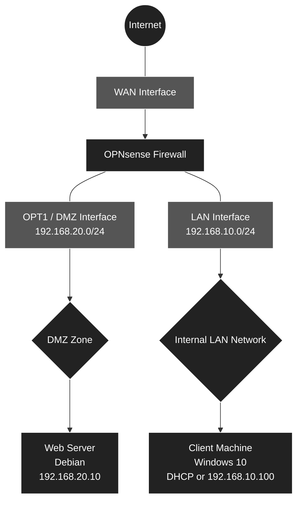

# 🛡️ Network Infrastructure, Security, and Segmentation

<br>


# 1. Architecture and IP Addressing

<br>

## 1.1 Architecture Diagram
Here is the logical architecture of our infrastructure, separated into two distinct zones (LAN and DMZ) to isolate the Web server accessible from the outside.



<br>

## 1.2 IP Addressing Plan and Sizing

<br>

| VM Role | System | vCPU | RAM | Disk | Interfaces | Virtual Networks | IP Addresses |
| :--- | :--- | :---: | :---: | :---: | :--- | :--- | :--- |
| **Firewall** | OPNsense | 1 | 1-2 GB | 20 GB | WAN (em0), LAN (em1), DMZ (em2) | **VMnet8** (NAT), **VMnet10** (Host-only), **VMnet20** (Host-only) | DHCP, `192.168.10.1/24`, `192.168.20.1/24` |
| **Web Server** | Debian 12 | 1 | 1-2 GB | 25 GB | eth0 | **VMnet20** (DMZ) | `192.168.20.10/24` (Static) |
| **Client** | Windows 10 | 4 | 4-6 GB | 40 GB | Ethernet0 | **VMnet10** (LAN) | OPNsense DHCP (`192.168.10.x`) |

<br>

# 📋 Deployment Plan: Network and Security Infrastructure under VMware

This document details the steps to build the virtual infrastructure including a firewall (OPNsense), an internal network (LAN) with a client workstation, and a demilitarized zone (DMZ) hosting a Web server.

<br>

## 🛠️ Phase 1: Preparation of virtual networks (Virtual Network Editor)

The very first step is to prepare the virtual "wiring" in VMware before even creating the machines.
- **WAN (VMnet8 - NAT):** Verification of the default network allowing the firewall to access the Internet.
- **LAN (VMnet10 - Host-only):** Creation of the virtual switch for the internal network, disabling VMware's native DHCP (since OPNsense will handle it).
- **DMZ (VMnet20 - Host-only):** Creation of the virtual switch for the isolated public zone, also disabling VMware's DHCP.

<br>

## 🖥️ Phase 2: Creation of Virtual Machines (Empty Shells)

We will configure the three machines according to the sizing table defined in the architecture.
- **OPNsense Firewall:** 1 vCPU, 2 GB RAM, 20 GB Disk. Strict addition of the 3 network cards in the correct order to simplify configuration: WAN (VMnet8) first, LAN (VMnet10) second, DMZ (VMnet20) third.
- **Web Server (Debian 12):** 1 vCPU, 2 GB RAM, 25 GB Disk. Addition of a single network card assigned to the DMZ (VMnet20).
- **Client (Windows 10):** 4 vCPU, 6 GB RAM, 40 GB Disk. Addition of a single network card assigned to the LAN (VMnet10).

<br>

## 🔥 Phase 3: Installation and Initial Configuration of OPNsense (Console)

Deployment of the central router of our infrastructure.
- Installation of the OPNsense OS from the ISO.
- Assignment of the virtual physical interfaces (`em0`, `em1`, `em2`) to their respective roles (WAN, LAN, OPT1/DMZ).
- Configuration of static IP addresses from the console for the LAN (`192.168.10.1/24`) and the DMZ (`192.168.20.1/24`).
- Activation of the DHCP server on the LAN interface to distribute IPs to future clients.

<br>

## 💻 Phase 4: Deployment of the Client Machine (Windows 10)

Setup of the user workstation in the internal network, which will also serve as the administration workstation.
- Installation of Windows 10.
- Verification of the correct retrieval of the IP address (`192.168.10.x`) via the OPNsense DHCP.
- Access to the OPNsense Web graphical interface (WebGUI) from the client's browser.

<br>

## 🌐 Phase 5: Deployment of the Web Server (Debian 12)

Setup of the server in the isolated zone.
- Installation of Debian 12 (without a graphical interface for a lighter footprint).
- Network configuration with a static IP (`192.168.20.10`, gateway `192.168.20.1`, DNS).
- Installation of the Web service (Nginx or Apache) and creation of a custom HTML test homepage.

<br>

## 🛡️ Phase 6: Firewall Rules and Routing (OPNsense Web Interface)

Securing network flows from the OPNsense graphical interface.
- **LAN Rules:** Allow the internal network to access the Internet and the DMZ.
- **DMZ Rules:** Isolate the Web server (block connections initiated from the DMZ to the LAN, but allow Internet access for Debian updates).
- **NAT (Port Forwarding):** Redirect incoming traffic (from the WAN network) on port 80 to the Debian server's IP (`192.168.20.10`) to simulate access from the outside.

<br>

## ✅ Phase 7: Final validation tests

Verification of the compliance and airtightness of the architecture.
- **Access test:** Access to the Debian web page from the Windows client (must succeed).
- **Isolation test:** Ping from the Debian machine to the Windows machine (must be blocked by DMZ rules).
- **External access test (NAT):** Access to the Web server from the physical host machine (your PC) via the OPNsense WAN IP.

<br>

---

<br>

## 🛠️ Phase 1: Preparation of virtual networks (VMware)

Before creating the virtual machines, we must configure the Virtual Switches that will connect our different zones. In VMware Workstation, this is managed via the **Virtual Network Editor**.

<br>

### 1. Opening the Virtual Network Editor

1. Launch **VMware Workstation**.
2. In the top menu, click on **Edit** > **Virtual Network Editor...**.
3. *Important:* If the settings are grayed out, click the **Change Settings** button at the bottom right (with the Administrator shield) and validate the Windows User Account Control prompt.

<br>

### 2. Verification of the WAN network (VMnet8)

This network already exists by default; it is the one that will provide Internet access to your OPNsense firewall.

1. In the list of networks at the top, locate **VMnet8**.
2. Verify that the *Type* column indicates **NAT**.
3. Ensure that the boxes **Connect a host virtual adapter to this network** and **Use local DHCP service to distribute IP address to VMs** are **checked**.
4. Leave the default *Subnet IP* (it varies depending on your VMware installation, which is fine).

<br>

### 3. Creation of the LAN network (VMnet10)

Here we create the internal network for your Windows client. This network must be isolated and OPNsense will distribute the IP addresses, so VMware's DHCP must be disabled.

1. Click on the **Add Network...** button at the bottom right.
2. In the drop-down menu, choose **VMnet10** and click **OK**.
3. Select **VMnet10** in the list, then configure it exactly like this:
   - **Type:** Select **Host-only** (Connect VMs internally in a private network).
   - **Connect a host virtual adapter...:** You can leave this checked (allows your physical PC to communicate with the LAN).
   - **Use local DHCP service...:** ❌ **IMPERATIVELY UNCHECK THIS BOX** (our OPNsense will act as the DHCP server).
   - **Subnet IP:** Enter `192.168.10.0`
   - **Subnet mask:** Enter `255.255.255.0`

<br>

### 4. Creation of the DMZ network (VMnet20)

Here we create the isolated public zone for your Debian Web server.

1. Click again on **Add Network...**.
2. Choose **VMnet20** and click **OK**.
3. Select **VMnet20** in the list, then configure it:
   - **Type:** Select **Host-only**.
   - **Connect a host virtual adapter...:** Leave checked.
   - **Use local DHCP service...:** ❌ **IMPERATIVELY UNCHECK THIS BOX** (the Web server will have a static IP).
   - **Subnet IP:** Enter `192.168.20.0`
   - **Subnet mask:** Enter `255.255.255.0`

<br>

### 5. Validation

1. Click on the **Apply** button at the bottom right (VMware will restart its network services; this takes a few seconds).
2. Click **OK** to close the window.

The virtual wiring is now ready!

<br>

## 🖥️ Phase 2: Creation of Virtual Machines

In this step, we will create the three machines. For OPNsense and Windows, we will use automatic ISO detection. For Debian, due to a wizard limitation, we will create the machine empty before linking the ISO to it. **Warning: do not power on any VM at the end of the wizard**, we must first adjust the hardware and network.

<br>

### 1. Creation of the Firewall VM (OPNsense)

1. In VMware, click on **File** > **New Virtual Machine...** > **Typical (recommended)**.
2. Choose **Installer disc image file (iso)** and point to the OPNsense ISO (VMware will detect FreeBSD).
3. **Name:** Name the machine `OPNsense-Firewall`.
4. **Disk:** Enter **20 GB** (*Store virtual disk as a single file*).
5. **Ready to Create:** ❌ **Uncheck the box "Power on this virtual machine after creation"** then click **Finish**.

**Strict configuration of hardware and network cards:**
Right-click on the `OPNsense-Firewall` VM > **Settings...**
- **Memory (RAM):** Adjust to `2048` MB (2 GB).
- **Processors:** Adjust to `1`.
- **Network 1 (WAN):** Select the existing `Network Adapter` and verify it is on **NAT (VMnet8)**.
- **Network 2 (LAN):** Click on **Add...** > **Network Adapter** > **Finish**. Select this 2nd card, check **Custom: Specific virtual network** > choose **VMnet10**.
- **Network 3 (DMZ):** Click on **Add...** > **Network Adapter** > **Finish**. Select this 3rd card, check **Custom: Specific virtual network** > choose **VMnet20**.
- Click **OK**.

<br>

### 2. Creation of the Web Server VM (Debian 12/13)

This machine will be isolated in the demilitarized zone (DMZ). Since the ISO is not recognized by the wizard, we configure it manually.

1. Relaunch the wizard: **File** > **New Virtual Machine...** > **Typical (recommended)**.
2. Choose **I will install the operating system later** and click **Next**.
3. **Guest Operating System:** Choose **Linux**, then in the drop-down list, select **Debian 12.x 64-bit** (or Debian 13.x 64-bit if available).
4. **Name:** Name the machine `Serveur-Web-Debian`.
5. **Disk:** Enter **25 GB** (*Store virtual disk as a single file*). Click **Next** then **Finish**.

**Hardware, DMZ network, and ISO configuration:**
Right-click on the `Serveur-Web-Debian` VM > **Settings...**
- **Memory (RAM):** Adjust to `2048` MB (2 GB).
- **Processors:** Adjust to `1`.
- **Network (DMZ):** Select the `Network Adapter`, check **Custom: Specific virtual network** > choose **VMnet20**.
- **CD/DVD (IDE):** Select this component, check **Use ISO image file**, click **Browse...** and point to your Debian ISO file.
- Click **OK**.

<br>

### 3. Creation of the Client VM (Windows 10)

This machine will be in the internal network (LAN).

1. Relaunch the wizard: **File** > **New Virtual Machine...** > **Typical (recommended)**.
2. Choose **Installer disc image file (iso)** and point to the Windows 10 ISO.
3. No need for **activation keys and password, just select the Windows 10 Pro version and enter a name**.
4. **Name:** Name the machine `Client-Windows10`.
5. **Disk:** Enter **60 GB** (*Store virtual disk as a single file*).
6. **Ready to Create:** ❌ **Uncheck the box "Power on this virtual machine after creation"** then click **Finish**.

**Hardware and LAN network configuration:**
Right-click on the `Client-Windows10` VM > **Settings...**
- **Memory (RAM):** Adjust to `6144` MB (6 GB).
- **Processors:** Adjust to `4`.
- **Network (LAN):** Select the `Network Adapter`, check **Custom: Specific virtual network** > choose **VMnet10**.
- Click **OK**.

<br>

## 🔥 Phase 3: Installation and Initial Configuration of OPNsense (Console)

It is time to bring our central router to life. We will install the OPNsense operating system on the virtual machine, then assign its basic IP addresses for the LAN and DMZ via the command line.

<br>

### 1. Installation of the OPNsense system

1. In VMware, select the `OPNsense-Firewall` VM and click **Power on this virtual machine**.
2. Let the system boot (lines of text will scroll) until you reach a login prompt (`login:`).
3. Log in with the default LiveCD credentials:
   - **Login:** `installer`
   - **Password:** `opnsense` *(Note: the default keyboard layout is QWERTY)*.
4. The installation wizard opens (use the arrow keys and the Enter key):
   - **Keymap:** Leave on *Accept these Settings* (or change to your preferred keyboard layout).
   - **Task:** Choose **Install (UFS)** and validate.
   - **Disk:** Select your virtual disk (usually named `da0` or `vtbd0`) and validate with **YES** to erase data.
   - Let the installation finish (this takes about 2 to 3 minutes).
5. At the end, the wizard offers to restart (Reboot). **Before validating**, you must eject the ISO to avoid restarting the installation: 
   - Right-click on the OPNsense VM tab at the top > **Settings** > **CD/DVD** > uncheck **Connect at power on**. Click **OK**.
6. Now validate the **Reboot** in the OPNsense console.

<br>

### 2. Assignment of network cards

After the restart, OPNsense welcomes you with a configuration menu (options 0 to 13) and displays the current assignment of cards. By default, FreeBSD names your cards `em0`, `em1`, and `em2`. We must ensure they are in the correct order.

1. Log in with the freshly installed root credentials:
   - **Login:** `root`
   - **Password:** `opnsense`
2. Type option **1** (Assign Interfaces) and press Enter:
   - *Do you want to configure LAGGs?* -> Type **N** and press Enter.
   - *Do you want to configure VLANs?* -> Type **N** and press Enter.
   - *Enter the WAN interface name:* -> Type `em0`.
   - *Enter the LAN interface name:* -> Type `em1`.
   - *Enter the Optional 1 interface name:* -> Type `em2` (This is our DMZ).
   - Leave the next line blank and press **Enter** to finish the assignment.
   - *Do you want to proceed?* -> Type **y** (Yes).

<br>

### 3. Configuration of IP addresses (LAN and DMZ)

The system will reload the interfaces. We will now apply your IP addressing plan.

**A. LAN Configuration (VMnet10):**
1. In the main menu, type **2** (Set interface IP address).
2. Select the **LAN** interface (type the corresponding number, usually `2`).
3. *Configure IPv4 address LAN interface via DHCP?* -> **n** (No).
4. *Enter the new LAN IPv4 address:* -> Type `192.168.10.1`
5. *Enter the new LAN IPv4 subnet bit count:* -> Type `24`
6. *For a WAN, enter the new LAN IPv4 upstream gateway...* -> Simply press **Enter** (leave blank for the LAN).
7. *Configure IPv6 address LAN interface via DHCP6?* -> **n** (Press Enter to skip IPv6 configuration).
8. *Do you want to enable the DHCP server on LAN?* -> **y** (Yes).
9. *Enter the start address of the IPv4 client address range:* -> `192.168.10.100`
10. *Enter the end address:* -> `192.168.10.150`
11. *Do you want to change the web GUI protocol from HTTPS to HTTP?* -> **n** (No, keep secure HTTPS).

**B. DMZ Configuration (OPT1 - VMnet20):**
1. Back at the menu, type **2** again (Set interface IP address).
2. Select the **OPT1** interface (usually `3`).
3. *Configure IPv4 address OPT1 interface via DHCP?* -> **n**.
4. *Enter the new OPT1 IPv4 address:* -> Type `192.168.20.1`
5. *Enter the new OPT1 IPv4 subnet bit count:* -> Type `24`
6. *Gateway:* -> Press **Enter**.
7. *IPv6:* -> **n** then Enter to skip.
8. *Do you want to enable the DHCP server on OPT1?* -> **n** (No, our Debian server will have a static IP).

Let the router apply the settings. The top of your menu should now proudly display:
- **WAN** (em0): *An IP address distributed by your VMware's NAT (e.g., 192.168.x.x)*
- **LAN** (em1): `192.168.10.1/24`
- **OPT1** (em2): `192.168.20.1/24`

<br>

## 💻 Phase 4: Deployment of the Client (Windows 10) and OPNsense Web Access

This machine, located in the internal network (LAN), will automatically retrieve an IP address via the firewall and will serve as our graphical administration workstation.

<br>

### 1. Installation of Windows 10

1. In VMware, select the `Client-Windows10` VM and click **Power on this virtual machine**.
2. Press any key at startup to boot from the ISO.
3. Follow the standard Windows installation wizard:
   - Choose **I don't have a product key**.
   - Select **Windows 10 Pro**.
   - Choose the **Custom** installation and select the 40 GB disk.
4. During the initial setup (OOBE), select a configuration for personal use and create an offline local account (without a Microsoft account) to save time.

<br>

### 2. Verification of IP Addressing (DHCP)

Once on the Windows desktop, we will verify that the machine is communicating well with OPNsense.

1. Right-click on the Windows Start button > **Windows PowerShell** (or Command Prompt).
2. Type the command `ipconfig` and press Enter.
3. Check the Ethernet adapter information (which physically corresponds to your VMnet10):
   - **IPv4 Address:** You should have an IP in the range defined in Phase 3 (e.g., `192.168.10.100`).
   - **Default Gateway:** You should see your firewall's IP `192.168.10.1`.
   - *Optional test:* Type `ping 8.8.8.8` to verify that your client has Internet access through OPNsense.

<br>

### 3. First access to the OPNsense Web interface (WebGUI)

Now that the client machine is properly addressed on the LAN, it can administer the firewall.

1. Open the Microsoft Edge browser on the Windows 10 machine.
2. In the address bar, type `https://192.168.10.1` and press Enter.
3. A security warning appears because the SSL certificate is self-signed. Click on **Advanced settings** (or *Advanced*), then on **Continue to 192.168.10.1 (unsafe)**.
4. Log in with the default credentials defined in Phase 3:
   - **Username:** `root`
   - **Password:** `opnsense` (or another if you changed the password at the end of the OPNsense installation).

<br>

### 4. OPNsense Initial Configuration Wizard

A first boot assistant (*Wizard*) launches automatically upon your first login. Click **Next** to go through the steps:

- **General Information:** 
  - *Hostname:* Leave `OPNsense` (or change it as you wish).
  - *Domain:* Leave `localdomain`.
  - *Primary DNS Server:* You can enter `8.8.8.8` (or leave blank to inherit the configuration from VMware's NAT network).
  - **DNS Configuration (according to your settings):**
    - Check the box **Override DNS**.
    - Under the *DNS [Unbound]* section, check the box **Enable Resolver**.
    - Ensure that the **Enable DNSSEC Support** and **Harden DNSSEC data** boxes are unchecked.
    - Click **Next**.
- **Time Server:** Select your time zone (e.g., `Europe/Paris`).
- **Network [WAN]:**
  - *Type:* Leave on **DHCP**.
  - *Default policies:*
    - ❌ **Block RFC1918 Private Networks:** **IMPERATIVELY UNCHECK** this box. Your WAN interface is connected to the VMware NAT (`VMnet8`), which uses private addressing. If this option remains active, OPNsense will reject packets from your physical local network and block port forwarding (NAT).
    - ❌ **Block bogon networks:** Also **UNCHECK** this box to avoid blocking reserved ranges in a virtual lab.
  - Click **Next**.
- **Network [LAN]:**
  - Verify that the IP address is indeed `192.168.10.1/24`.
  - ✅ **Configure DHCP server:** **LEAVE THIS BOX CHECKED**.
    - *Why?* During Phase 1, we deliberately disabled VMware's internal DHCP service on the `VMnet10` switch. It is OPNsense that must perform this role to dynamically distribute the IP addresses, mask, gateway, and DNS server to your Windows 10 machine (as well as to any other host connected later to this internal network). If you uncheck this option, the Windows workstation will lose its address lease and will no longer have network access without manual IP configuration.
  - Click **Next**
- **Deployment type:**
  - ❌ **Optimize for Multiwan:** **UNCHECK** the box. We only have one WAN link (`VMnet8`); this optimization is only necessary when aggregating multiple Internet access points.
  - ✅ **Automatic DHCP/DNS registration:** **LEAVE CHECKED**. Allows the local DNS resolver (Unbound) to automatically resolve the names of client machines on the LAN.
  - ❌ **Optimize for IPsec:** **LEAVE UNCHECKED**. No VPN tunnel of this type is set up in this lab.
  - Click **Next**
- **Set Root Password:**
  - Set a new administrator password to secure access.
- **Reload Configuration:**
  - Click on **Reload** to apply the settings.

> ⚠️ **Warning – Loss of connectivity after host sleep:**
> 
> If the physical computer goes to sleep, Windows suspends the virtual network adapters and the VMware NAT service may freeze when the system wakes up.
> 
> * **Symptom:** OPNsense loses Internet access, updates fail, and the NAT gateway (`192.168.38.2`) no longer responds to pings (`Host is down`).
> * **Resolution:** On the Windows host machine, open the Run window (**Windows + R**), type `services.msc`, and restart the **VMware NAT Service** and **VMware DHCP Service** services. Connectivity and access to repositories will be restored immediately.

## 🌐 Phase 5: Deployment of the Web Server (Debian 12)

We will now install the Web server in the isolated zone (DMZ). Before starting the installation, we must allow this zone to access the Internet to be able to download the Nginx package.

<br>

### 1. Prerequisite: Allow Internet access for the DMZ (from Windows 10)

1. Return to your **Windows 10 Client** and open the OPNsense Web interface.
2. In the left menu, navigate to **Firewall** > **Rules** > **OPT1** (your DMZ).
3. Click on the orange **+ (Add)** button at the top right to create a rule:
   - **Action:** Pass
   - **Interface:** OPT1
   - **Direction:** in
   - **Protocol:** any
   - **Source:** OPT1 net
   - **Destination:** any
   - **Description:** Temporary DMZ Internet access (Debian installation)
4. Click **Save** at the bottom, then **Apply Changes**.
   *(Why this action? Optional interfaces (OPT) in OPNsense are subject to a total block rule "Deny All" by default. This temporary permissive rule allows the Debian machine to go out to the Internet to install and update itself. We will restrict it later in Phase 6).*

<br>

### 2. Debian 12 OS Installation

1. In VMware, select the `Serveur-Web-Debian` VM and click **Power on this virtual machine**.
2. In the boot menu, choose **Install** (the classic text mode installation, which is lighter).
3. Select your language preferences (English) and keyboard layout.
4. **Network configuration (Crucial step):**
   - The installer will attempt to configure the network via DHCP. **This will fail** (and this is normal, as DHCP is disabled on the DMZ).
   - Click **Continue** then choose **Configure network manually**.
   - **IP Address:** Enter `192.168.20.10`
   - **Subnet mask:** Leave `255.255.255.0`
   - **Gateway:** Enter `192.168.20.1` (the IP of your OPNsense firewall on the DMZ side).
   - **Name servers (DNS):** Enter `8.8.8.8` (or the IP of the OPNsense DMZ).
   - **Hostname:** Leave `serveur-web` (or `debian`).
5. Configure the passwords (root) and create your standard user account.
6. **Disk partitioning:** Choose *Guided - use entire disk*, validate the default choices, and accept writing changes to the disks.
7. **Software selection (Tasksel):**
   - ❌ **UNCHECK** *Debian desktop environment* and *GNOME* (use the spacebar to uncheck). A server does not need a graphical interface; it unnecessarily consumes RAM and CPU resources.
   - ✅ **CHECK** only *SSH server* and *standard system utilities*.
8. Let the installation finish and accept installing the GRUB boot loader on the primary drive (`/dev/sda`). The VM will restart.

<br>

### 3. Installation and configuration of the Web service (Nginx)

Once Debian has restarted, you will be facing a black screen with a command prompt (`login:`).

1. Log in with the `root` identifier and the password defined during installation.
2. Verify that the machine successfully accesses the Internet (thanks to the OPNsense rule created in step 1):
   ```bash
   ping -c 4 8.8.8.8
   ```

3. Update the package list and install the Nginx Web server:
   ```bash
   apt install nginx -y
   ```

4. Replace the default Nginx homepage with a custom page specific to our lab:
   ```bash
   echo "<h1>Welcome to the DMZ - Web Server (192.168.20.10)</h1>" > /var/www/html/index.html
   ```

5. Verify that the Web service is running correctly:
   ```bash
   systemctl status nginx
   ```

## 🛡️ Phase 6: Firewall Rules and Redirection (NAT)

Now that the Web server is operational in its isolated zone, we will refine the security of the DMZ and set up port forwarding to make the site accessible from the outside.

### 1. Secure the DMZ (OPT1 Interface)

A DMZ has the right to respond and go to the Internet, but it has **an absolute prohibition against initiating a connection to the internal network (LAN)**.

1. From the Windows 10 client, go to **Firewall > Rules > OPT1**.
2. Click on the orange **+ (Add)** button to create a new block rule:
   - **Action:** Block
   - **Direction:** in
   - **Protocol:** any
   - **Source:** OPT1 net
   - **Destination:** LAN net
   - **Description:** Isolate the DMZ from the LAN
3. Click **Save**.
4. ⚠️ **Important:** In the list, this block rule (red icon) must imperatively be **ABOVE** the "Pass All" authorization rule (green icon) created in Phase 5.
5. Click **Apply Changes**.

### 2. NAT Prerequisite: Free up port 80 on the firewall

By default, OPNsense listens on port 80 to automatically redirect administrators to its secure interface (HTTPS/443). We must disable this interception so our redirection to the web server works.

1. Go to **System > Settings > Administration**.
2. In the *Web GUI* section, check the box **Disable web GUI redirect rule**.
3. Scroll all the way down and click **Save**.

### 3. Port Forwarding (NAT)

We are going to simulate access from the Internet. All HTTP traffic arriving on the firewall's WAN interface will be invisibly redirected to the Debian server.

1. Go to **Firewall > NAT > Port Forward**.
2. Click on the orange **+ (Add)** button:
   - **Interface:** WAN
   - **TCP/IP Version:** IPv4
   - **Protocol:** TCP
   - **Destination:** WAN address
   - **Destination port range:** from `HTTP` to `HTTP`
   - **Redirect target IP:** `192.168.20.10` (The Debian server)
   - **Redirect target port:** `HTTP`
   - **Description:** HTTP NAT to DMZ Web Server
   - **Filter rule association (under Options section):** Select **Add associated filter rule** (or *Register rule*). This is crucial; it tells OPNsense to automatically create the opening rule on the WAN interface.
3. Click **Save** then **Apply Changes**.

> 💡 **Alternative: Manual creation of the firewall rule**
> If you left the *Filter rule association* option on **None** (or Manual) when creating the NAT, the redirection will not work because the firewall will block the input. You must then manually allow the traffic:
> 1. Go to **Firewall > Rules > WAN**.
> 2. Click on the orange **+ (Add)** button:
>    - **Action:** Pass
>    - **Interface:** WAN
>    - **Protocol:** TCP
>    - **Source:** any
>    - **Destination:** Single host or Network -> Enter `192.168.20.10`
>    - **Destination port range:** from `HTTP` to `HTTP`
>    - **Description:** Allow incoming HTTP to DMZ (Manual)
> 3. Click **Save** then **Apply Changes**.

<br>

## ✅ Phase 7: Final validation tests

The infrastructure is finished. Here is the test plan to validate network airtightness:

1. **Internet access test from the LAN:** 
   - From Windows 10, launch a ping to `8.8.8.8`. (Must succeed).
2. **Access test to the exposed service (LAN to DMZ):** 
   - From Windows 10, open a browser and type `http://192.168.20.10`. The Nginx page must appear.
3. **Isolation test (Security):** 
   - From the Debian machine, attempt to ping the Windows client IP (`192.168.10.x`). **The ping must fail**, blocked by the Phase 6 rule.
4. **NAT test (Internet Exposure):** 
   - From your physical host PC, open a browser and type the OPNsense WAN IP address (the one from the `VMnet8` network). You must land on the Debian server's web page.