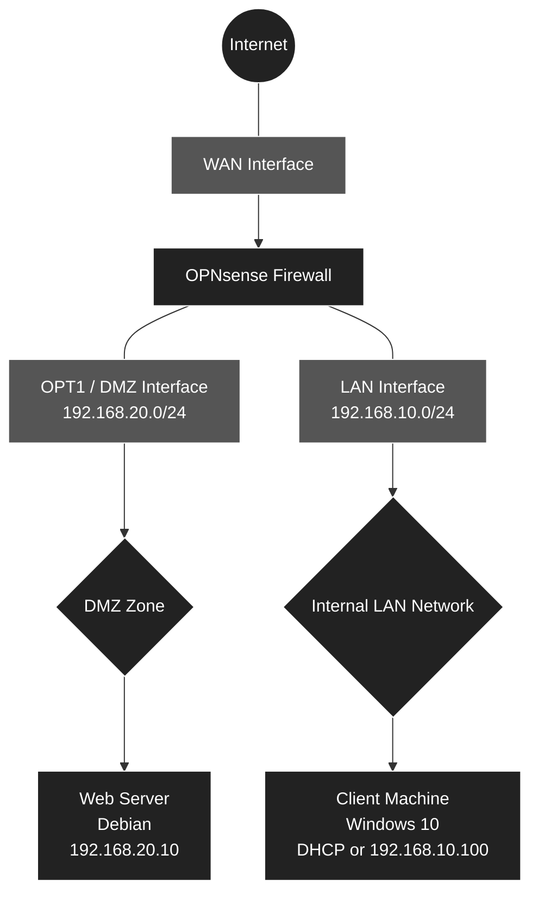

# 🛡️ Network Infrastructure, Security, and Segmentation

# 1. Architecture and IP Addressing

## 1.1 Architecture Diagram

The following is the logical architecture of the infrastructure, separated into two distinct zones (LAN and DMZ) to isolate the Web server accessible from the outside.



## 1.2 IP Addressing Plan and Sizing

| VM Role | System | vCPU | RAM | Disk | Interfaces | Virtual Networks | IP Addresses |
| :--- | :--- | :---: | :---: | :---: | :--- | :--- | :--- |
| **Firewall** | OPNsense | 1 | 1-2 GB | 20 GB | WAN (em0), LAN (em1), DMZ (em2) | **VMnet8** (NAT), **VMnet10** (Host-only), **VMnet20** (Host-only) | DHCP, `192.168.10.1/24`, `192.168.20.1/24` |
| **Web Server** | Debian 12 | 1 | 1-2 GB | 25 GB | eth0 | **VMnet20** (DMZ) | `192.168.20.10/24` (Static) |
| **Client** | Windows 10 | 4 | 4-6 GB | 40 GB | Ethernet0 | **VMnet10** (LAN) | OPNsense DHCP (`192.168.10.x`) |

# 📋 Deployment Plan: Network and Security Infrastructure under VMware

This document details the steps required to build the virtual infrastructure, including a firewall (OPNsense), an internal network (LAN) with a client workstation, and a demilitarized zone (DMZ) hosting a Web server.

## 🛠️ Phase 1: Preparation of Virtual Networks (Virtual Network Editor)

The initial step involves configuring the virtual network switches in VMware before creating the virtual machines.

* **WAN (VMnet8 - NAT):** Verification of the default network allowing the firewall to access the Internet.
* **LAN (VMnet10 - Host-only):** Creation of the virtual switch for the internal network, disabling VMware's native DHCP (since OPNsense will handle IP distribution).
* **DMZ (VMnet20 - Host-only):** Creation of the virtual switch for the isolated public zone, also disabling VMware's DHCP.

## 🖥️ Phase 2: Creation of Virtual Machines (Empty Shells)

The three machines must be configured according to the sizing table defined in the architecture.

* **OPNsense Firewall:** 1 vCPU, 2 GB RAM, 20 GB Disk. Strict addition of the 3 network cards in the correct order to simplify configuration: WAN (VMnet8) first, LAN (VMnet10) second, DMZ (VMnet20) third.
* **Web Server (Debian 12):** 1 vCPU, 2 GB RAM, 25 GB Disk. Addition of a single network card assigned to the DMZ (VMnet20).
* **Client (Windows 10):** 4 vCPU, 6 GB RAM, 40 GB Disk. Addition of a single network card assigned to the LAN (VMnet10).

## 🔥 Phase 3: Installation and Initial Configuration of OPNsense (Console)

Deployment of the central router of the infrastructure.

* Installation of the OPNsense OS from the ISO.
* Assignment of the virtual physical interfaces (`em0`, `em1`, `em2`) to their respective roles (WAN, LAN, OPT1/DMZ).
* Configuration of static IP addresses from the console for the LAN (`192.168.10.1/24`) and the DMZ (`192.168.20.1/24`).
* Activation of the DHCP server on the LAN interface to distribute IP addresses to clients.

## 💻 Phase 4: Deployment of the Client Machine (Windows 10)

Setup of the user workstation in the internal network, which will also serve as the administration workstation.

* Installation of Windows 10.
* Verification of the successful IP address retrieval (`192.168.10.x`) via the OPNsense DHCP.
* Access to the OPNsense Web graphical interface (WebGUI) from the client's browser.

## 🌐 Phase 5: Deployment of the Web Server (Debian 12)

Setup of the server in the isolated zone.

* Installation of Debian 12 (without a graphical interface for optimized performance).
* Network configuration with a static IP (`192.168.20.10`, gateway `192.168.20.1`, DNS).
* Installation of the Web service (Nginx or Apache) and creation of a custom HTML test homepage.

## 🛡️ Phase 6: Firewall Rules and Routing (OPNsense Web Interface)

Securing network flows from the OPNsense graphical interface.

* **LAN Rules:** Allow the internal network to access the Internet and the DMZ.
* **DMZ Rules:** Isolate the Web server (block connections initiated from the DMZ to the LAN, but allow Internet access for Debian updates).
* **NAT (Port Forwarding):** Redirect incoming traffic (from the WAN network) on port 80 to the Debian server's IP (`192.168.20.10`) to simulate external access.

## ✅ Phase 7: Final Validation Tests

Verification of compliance and network isolation.

* **Access test:** Access the Debian web page from the Windows client (must succeed).
* **Isolation test:** Ping from the Debian machine to the Windows machine (must be blocked by DMZ rules).
* **External access test (NAT):** Access the Web server from the physical host machine via the OPNsense WAN IP.

---

## 🛠️ Phase 1: Preparation of Virtual Networks (VMware)

Before creating the virtual machines, the Virtual Switches that connect the different zones must be configured. In VMware Workstation, this is managed via the **Virtual Network Editor**.

### 1. Opening the Virtual Network Editor

1. Launch **VMware Workstation**.
2. In the top menu, click on **Edit** > **Virtual Network Editor...**.
3. *Important:* If the settings are grayed out, click the **Change Settings** button at the bottom right (with the Administrator shield icon) and validate the Windows User Account Control prompt.

### 2. Verification of the WAN Network (VMnet8)

This network exists by default; it provides Internet access to the OPNsense firewall.

1. In the list of networks at the top, locate **VMnet8**.
2. Verify that the *Type* column indicates **NAT**.
3. Ensure that the checkboxes for **Connect a host virtual adapter to this network** and **Use local DHCP service to distribute IP address to VMs** are **checked**.
4. Leave the default *Subnet IP* unchanged.

### 3. Creation of the LAN Network (VMnet10)

This step creates the internal network for the Windows client. This network must be isolated. OPNsense will manage IP addresses; therefore, VMware's DHCP must be disabled.

1. Click on the **Add Network...** button at the bottom right.
2. In the drop-down menu, choose **VMnet10** and click **OK**.
3. Select **VMnet10** in the list, then configure it as follows:
   * **Type:** Select **Host-only** (Connect VMs internally in a private network).
   * **Connect a host virtual adapter...:** Leave this checked (allows the physical host to communicate with the LAN).
   * **Use local DHCP service...:** ❌ **IMPERATIVELY UNCHECK THIS BOX** (OPNsense will act as the DHCP server).
   * **Subnet IP:** Enter `192.168.10.0`
   * **Subnet mask:** Enter `255.255.255.0`

### 4. Creation of the DMZ Network (VMnet20)

This step creates the isolated public zone for the Debian Web server.

1. Click again on **Add Network...**.
2. Choose **VMnet20** and click **OK**.
3. Select **VMnet20** in the list, then configure it:
   * **Type:** Select **Host-only**.
   * **Connect a host virtual adapter...:** Leave checked.
   * **Use local DHCP service...:** ❌ **IMPERATIVELY UNCHECK THIS BOX** (the Web server will utilize a static IP).
   * **Subnet IP:** Enter `192.168.20.0`
   * **Subnet mask:** Enter `255.255.255.0`

### 5. Validation

1. Click on the **Apply** button at the bottom right (VMware will restart its network services; this process takes a few seconds).
2. Click **OK** to close the window.

The virtual network infrastructure is now ready.

## 🖥️ Phase 2: Creation of Virtual Machines

During this phase, the three virtual machines will be created. Automatic ISO detection will be used for OPNsense and Windows. For Debian, due to an installation wizard limitation, the machine must be created prior to linking the ISO. **Warning: do not power on any VM at the end of the wizard**, as hardware and network settings must be adjusted first.

### 1. Creation of the Firewall VM (OPNsense)

1. In VMware, click on **File** > **New Virtual Machine...** > **Typical (recommended)**.
2. Choose **Installer disc image file (iso)** and point to the OPNsense ISO file (VMware will detect FreeBSD).
3. **Name:** Name the machine `OPNsense-Firewall`.
4. **Disk:** Enter **20 GB** (*Store virtual disk as a single file*).
5. **Ready to Create:** ❌ **Uncheck the box "Power on this virtual machine after creation"** then click **Finish**.

**Strict configuration of hardware and network adapters:**
Right-click on the `OPNsense-Firewall` VM > **Settings...**

* **Memory (RAM):** Adjust to `2048` MB (2 GB).
* **Processors:** Adjust to `1`.
* **Network 1 (WAN):** Select the existing `Network Adapter` and verify it is set to **NAT (VMnet8)**.
* **Network 2 (LAN):** Click on **Add...** > **Network Adapter** > **Finish**. Select this second adapter, check **Custom: Specific virtual network**, and choose **VMnet10**.
* **Network 3 (DMZ):** Click on **Add...** > **Network Adapter** > **Finish**. Select this third adapter, check **Custom: Specific virtual network**, and choose **VMnet20**.
* Click **OK**.

### 2. Creation of the Web Server VM (Debian 12/13)

This machine will be isolated within the demilitarized zone (DMZ). Because the ISO is not natively recognized by the wizard, manual configuration is required.

1. Relaunch the wizard: **File** > **New Virtual Machine...** > **Typical (recommended)**.
2. Choose **I will install the operating system later** and click **Next**.
3. **Guest Operating System:** Choose **Linux**, then in the drop-down menu, select **Debian 12.x 64-bit** (or Debian 13.x 64-bit if available).
4. **Name:** Name the machine `Serveur-Web-Debian`.
5. **Disk:** Enter **25 GB** (*Store virtual disk as a single file*). Click **Next** then **Finish**.

**Hardware, DMZ network, and ISO configuration:**
Right-click on the `Serveur-Web-Debian` VM > **Settings...**

* **Memory (RAM):** Adjust to `2048` MB (2 GB).
* **Processors:** Adjust to `1`.
* **Network (DMZ):** Select the `Network Adapter`, check **Custom: Specific virtual network**, and choose **VMnet20**.
* **CD/DVD (IDE):** Select this component, check **Use ISO image file**, click **Browse...**, and point to the Debian ISO file.
* Click **OK**.

### 3. Creation of the Client VM (Windows 10)

This machine will reside in the internal network (LAN).

1. Relaunch the wizard: **File** > **New Virtual Machine...** > **Typical (recommended)**.
2. Choose **Installer disc image file (iso)** and point to the Windows 10 ISO.
3. No activation keys or passwords are required; simply select the Windows 10 Pro version and assign a name.
4. **Name:** Name the machine `Client-Windows10`.
5. **Disk:** Enter **60 GB** (*Store virtual disk as a single file*).
6. **Ready to Create:** ❌ **Uncheck the box "Power on this virtual machine after creation"** then click **Finish**.

**Hardware and LAN network configuration:**
Right-click on the `Client-Windows10` VM > **Settings...**

* **Memory (RAM):** Adjust to `6144` MB (6 GB).
* **Processors:** Adjust to `4`.
* **Network (LAN):** Select the `Network Adapter`, check **Custom: Specific virtual network**, and choose **VMnet10**.
* Click **OK**.

## 🔥 Phase 3: Installation and Initial Configuration of OPNsense (Console)

The central router can now be deployed. Install the OPNsense operating system on the virtual machine, then assign its basic IP addresses for the LAN and DMZ via the command line interface.

### 1. Installation of the OPNsense System

1. In VMware, select the `OPNsense-Firewall` VM and click **Power on this virtual machine**.
2. Allow the system to boot until the login prompt (`login:`) appears.
3. Log in using the default LiveCD credentials:
   * **Login:** `installer`
   * **Password:** `opnsense` *(Note: The default keyboard layout is QWERTY)*.
4. The installation wizard will open (navigate using the arrow keys and Enter):
   * **Keymap:** Leave on *Accept these Settings* (or select the appropriate regional layout).
   * **Task:** Choose **Install (UFS)** and validate.
   * **Disk:** Select the virtual disk (typically named `da0` or `vtbd0`) and confirm with **YES** to format the drive.
   * Allow the installation process to finish (approximately 2 to 3 minutes).
5. Once completed, the wizard will prompt for a restart (Reboot). **Before validating**, the ISO must be ejected to prevent the installation loop from restarting:
   * Right-click the OPNsense VM tab at the top > **Settings** > **CD/DVD** > uncheck **Connect at power on**. Click **OK**.
6. Validate the **Reboot** command in the OPNsense console.

### 2. Assignment of Network Interfaces

Following the reboot, OPNsense will present a configuration menu (options 0 to 13) and display the current interface assignments. By default, FreeBSD designates adapters as `em0`, `em1`, and `em2`. These must be mapped in the correct order.

1. Log in with the newly installed root credentials:
   * **Login:** `root`
   * **Password:** `opnsense`
2. Enter option **1** (Assign Interfaces) and press Enter:
   * *Do you want to configure LAGGs?* -> Type **N** and press Enter.
   * *Do you want to configure VLANs?* -> Type **N** and press Enter.
   * *Enter the WAN interface name:* -> Type `em0`.
   * *Enter the LAN interface name:* -> Type `em1`.
   * *Enter the Optional 1 interface name:* -> Type `em2` (This corresponds to the DMZ).
   * Leave the subsequent prompt blank and press **Enter** to finalize the assignment.
   * *Do you want to proceed?* -> Type **y** (Yes).

### 3. Configuration of IP Addresses (LAN and DMZ)

The system will reload the interfaces. The IP addressing plan must now be applied.

**A. LAN Configuration (VMnet10):**

1. In the main menu, type **2** (Set interface IP address).
2. Select the **LAN** interface (typically option `2`).
3. *Configure IPv4 address LAN interface via DHCP?* -> **n** (No).
4. *Enter the new LAN IPv4 address:* -> Type `192.168.10.1`
5. *Enter the new LAN IPv4 subnet bit count:* -> Type `24`
6. *For a WAN, enter the new LAN IPv4 upstream gateway...* -> Press **Enter** (leave blank for the LAN).
7. *Configure IPv6 address LAN interface via DHCP6?* -> **n** (Press Enter to bypass IPv6 configuration).
8. *Do you want to enable the DHCP server on LAN?* -> **y** (Yes).
9. *Enter the start address of the IPv4 client address range:* -> `192.168.10.100`
10. *Enter the end address:* -> `192.168.10.150`
11. *Do you want to change the web GUI protocol from HTTPS to HTTP?* -> **n** (No; maintain secure HTTPS).

**B. DMZ Configuration (OPT1 - VMnet20):**

1. Return to the main menu and type **2** again (Set interface IP address).
2. Select the **OPT1** interface (typically option `3`).
3. *Configure IPv4 address OPT1 interface via DHCP?* -> **n**.
4. *Enter the new OPT1 IPv4 address:* -> Type `192.168.20.1`
5. *Enter the new OPT1 IPv4 subnet bit count:* -> Type `24`
6. *Gateway:* -> Press **Enter**.
7. *IPv6:* -> Type **n** then press Enter to skip.
8. *Do you want to enable the DHCP server on OPT1?* -> **n** (No; the Debian server requires a static IP).

Allow the router to apply the settings. The menu header should subsequently display:

* **WAN** (em0): *An IP address allocated by the VMware NAT (e.g., 192.168.x.x)*
* **LAN** (em1): `192.168.10.1/24`
* **OPT1** (em2): `192.168.20.1/24`

## 💻 Phase 4: Deployment of the Client (Windows 10) and OPNsense Web Access

This workstation, located in the internal network (LAN), will automatically retrieve an IP address via the firewall and serve as the graphical administration terminal.

### 1. Installation of Windows 10

1. In VMware, select the `Client-Windows10` VM and click **Power on this virtual machine**.
2. Press any key during startup to boot from the ISO.
3. Follow the standard Windows installation prompts:
   * Choose **I don't have a product key**.
   * Select **Windows 10 Pro**.
   * Choose the **Custom** installation and select the allocated 40 GB drive.
4. During the Out-Of-Box Experience (OOBE) setup, select a personal use configuration and create an offline local account (without a Microsoft account) to streamline the process.

### 2. Verification of IP Addressing (DHCP)

Once the Windows desktop has loaded, verify network communication with OPNsense.

1. Right-click the Windows Start button > **Windows PowerShell** (or Command Prompt).
2. Type the command `ipconfig` and press Enter.
3. Review the Ethernet adapter parameters (corresponding physically to VMnet10):
   * **IPv4 Address:** Must display an IP within the designated Phase 3 range (e.g., `192.168.10.100`).
   * **Default Gateway:** Must display the firewall IP `192.168.10.1`.
   * *Optional test:* Execute `ping 8.8.8.8` to confirm external Internet connectivity through OPNsense.

### 3. Initial Access to the OPNsense Web Interface (WebGUI)

With the client machine correctly configured on the LAN, firewall administration can commence.

1. Launch the Microsoft Edge browser on the Windows 10 system.
2. In the address bar, navigate to `https://192.168.10.1` and press Enter.
3. A security warning will appear due to the self-signed SSL certificate. Click **Advanced settings**, then select **Continue to 192.168.10.1 (unsafe)**.
4. Authenticate using the default credentials configured in Phase 3:
   * **Username:** `root`
   * **Password:** `opnsense` (or the modified password, if changed post-installation).

### 4. OPNsense Initial Configuration Wizard

An initial setup assistant (*Wizard*) will execute automatically upon the first login. Click **Next** to proceed through the stages:

* **General Information:**
  * *Hostname:* Retain `OPNsense` (or customize as required).
  * *Domain:* Retain `localdomain`.
  * *Primary DNS Server:* Input `8.8.8.8` (or leave empty to inherit settings from the VMware NAT).
  * **DNS Configuration:**
    * Check the **Override DNS** box.
    * Under the *DNS \[Unbound\]* section, check **Enable Resolver**.
    * Ensure the **Enable DNSSEC Support** and **Harden DNSSEC data** options remain unchecked.
    * Click **Next**.
* **Time Server:** Specify the correct regional time zone (e.g., `Europe/Paris`).
* **Network \[WAN\]:**
  * *Type:* Maintain as **DHCP**.
  * *Default policies:*
    * ❌ **Block RFC1918 Private Networks:** **IMPERATIVELY UNCHECK** this option. The WAN interface connects to the VMware NAT (`VMnet8`), utilizing private addressing. If active, OPNsense will drop packets from the physical local network and obstruct port forwarding (NAT).
    * ❌ **Block bogon networks:** **UNCHECK** this option to prevent blocking of reserved IP ranges within the virtual lab environment.
  * Click **Next**.
* **Network \[LAN\]:**
  * Confirm the IP address is `192.168.10.1/24`.
  * ✅ **Configure DHCP server:** **LEAVE CHECKED**.
    * *Rationale:* The internal VMware DHCP service for `VMnet10` was disabled in Phase 1. OPNsense assumes responsibility for dynamically allocating IP addresses, subnet masks, gateways, and DNS settings to the Windows 10 host. Disabling this option will result in a loss of IP lease and network connectivity for the workstation.
  * Click **Next**.
* **Deployment type:**
  * ❌ **Optimize for Multiwan:** **UNCHECK** this parameter. The topology features a single WAN link (`VMnet8`); this optimization is intended solely for aggregating multiple Internet connections.
  * ✅ **Automatic DHCP/DNS registration:** **LEAVE CHECKED**. This enables the local DNS resolver (Unbound) to automatically resolve hostnames for LAN clients.
  * ❌ **Optimize for IPsec:** **LEAVE UNCHECKED**. No VPN tunnels are configured in this deployment.
  * Click **Next**.
* **Set Root Password:**
  * Define a secure administrator password.
* **Reload Configuration:**
  * Click **Reload** to commit the settings.

> ⚠️ **Warning – Loss of Connectivity After Host Sleep State:**
>
> Should the physical host enter a sleep state, Windows suspends virtual network adapters, potentially causing the VMware NAT service to halt upon system resume.
>
> * **Symptom:** OPNsense loses Internet access, system updates fail, and the NAT gateway (`192.168.38.2`) returns `Host is down` responses to ICMP pings.
> * **Resolution:** On the physical Windows host, open the Run dialog (**Windows + R**), execute `services.msc`, and restart both the **VMware NAT Service** and **VMware DHCP Service**. Network connectivity and repository access will be immediately restored.

## 🌐 Phase 5: Deployment of the Web Server (Debian 12)

Installation of the Web server will now proceed within the isolated DMZ. Prior to installation, Internet access must be temporarily granted to this zone to facilitate package downloads (e.g., Nginx).

### 1. Prerequisite: Authorize Internet Access for the DMZ (via Windows 10)

1. Return to the **Windows 10 Client** and access the OPNsense WebGUI.
2. In the left navigation pane, navigate to **Firewall** > **Rules** > **OPT1** (the DMZ interface).
3. Click the orange **+ (Add)** button to generate a new rule:
   * **Action:** Pass
   * **Interface:** OPT1
   * **Direction:** in
   * **Protocol:** any
   * **Source:** OPT1 net
   * **Destination:** any
   * **Description:** Temporary DMZ Internet access for Debian setup
4. Click **Save** at the bottom of the form, then click **Apply Changes**.
   *(Note: Optional interfaces (OPT) in OPNsense are subject to an implicit "Deny All" block rule. This temporary permissive rule allows the Debian host outbound Internet access for OS installation and updates. Restrictions will be reapplied in Phase 6).*

### 2. Debian 12 OS Installation

1. In VMware, select the `Serveur-Web-Debian` VM and click **Power on this virtual machine**.
2. At the boot menu, select **Install** (the standard text-mode installation, recommended for servers).
3. Select appropriate language and keyboard layout preferences.
4. **Network Configuration (Critical Step):**
   * The installer will attempt DHCP configuration. **This operation will fail** (as DHCP is disabled on the DMZ segment).
   * Click **Continue**, then select **Configure network manually**.
   * **IP Address:** Input `192.168.20.10`
   * **Subnet mask:** Retain `255.255.255.0`
   * **Gateway:** Input `192.168.20.1` (the DMZ-facing IP of the OPNsense firewall).
   * **Name servers (DNS):** Input `8.8.8.8` (or the OPNsense DMZ IP).
   * **Hostname:** Enter `serveur-web` (or `debian`).
5. Configure system passwords (root account) and provision a standard user account.
6. **Disk Partitioning:** Select *Guided - use entire disk*, confirm the default selections, and authorize writing changes to the disk.
7. **Software Selection (Tasksel):**
   * ❌ **UNCHECK** *Debian desktop environment* and *GNOME* (use the spacebar). Server environments do not require Graphical User Interfaces, which consume unnecessary compute and memory resources.
   * ✅ **CHECK** only *SSH server* and *standard system utilities*.
8. Allow the installation to complete and authorize the installation of the GRUB boot loader to the primary drive (`/dev/sda`). The virtual machine will subsequently reboot.

### 3. Installation and Configuration of the Web Service (Nginx)

Upon system reboot, a command-line interface (`login:`) will be presented.

1. Authenticate using the `root` account credentials established during installation.
2. Verify outbound Internet connectivity (enabled by the Phase 5 step 1 firewall rule):
   ```
   ping -c 4 8.8.8.8
   ```
3. Update package repositories and install the Nginx Web server:
   ```
   apt update && apt install nginx -y
   ```
4. Replace the default Nginx index file with a custom diagnostic page:
   ```
   echo "<h1>Welcome to the DMZ - Web Server (192.168.20.10)</h1>" > /var/www/html/index.html
   ```
5. Confirm the Web service is executing properly:
   ```
   systemctl status nginx
   ```

## 🛡️ Phase 6: Firewall Rules and Port Forwarding (NAT)

With the Web server operational within its isolated zone, DMZ security parameters must be tightened, and port forwarding rules configured to expose the web service externally.

### 1. Secure the DMZ (OPT1 Interface)

A Demilitarized Zone is permitted to respond to external requests and initiate outbound Internet traffic; however, **initiating connections to the internal corporate network (LAN) is strictly prohibited**.

1. From the Windows 10 client, navigate to **Firewall > Rules > OPT1**.
2. Click the orange **+ (Add)** button to implement a block rule:
   * **Action:** Block
   * **Direction:** in
   * **Protocol:** any
   * **Source:** OPT1 net
   * **Destination:** LAN net
   * **Description:** Isolate DMZ from LAN
3. Click **Save**.
4. ⚠️ **Important:** Within the ruleset list, this explicit block rule (indicated by a red icon) must be positioned **ABOVE** the permissive "Pass All" rule (green icon) generated during Phase 5.
5. Click **Apply Changes**.

### 2. NAT Prerequisite: Release Port 80 on the Firewall

By default, the OPNsense WebGUI listens on port 80 to automatically redirect administrative sessions to the secure HTTPS port (443). This interception must be disabled to ensure HTTP traffic correctly routes to the web server.

1. Navigate to **System > Settings > Administration**.
2. Under the *Web GUI* header, check the option **Disable web GUI redirect rule**.
3. Scroll to the bottom of the interface and click **Save**.

### 3. Port Forwarding (Destination NAT)

This configuration simulates external Internet access. Inbound HTTP traffic arriving on the firewall's WAN interface will be transparently redirected to the Debian web server.

1. Navigate to **Firewall > NAT > Port Forward**.
2. Click the orange **+ (Add)** button to define the NAT rule:
   * **Interface:** WAN
   * **TCP/IP Version:** IPv4
   * **Protocol:** TCP
   * **Destination:** WAN address
   * **Destination port range:** from `HTTP` to `HTTP`
   * **Redirect target IP:** `192.168.20.10` (The Debian server IP)
   * **Redirect target port:** `HTTP`
   * **Description:** Inbound HTTP NAT to DMZ Web Server
   * **Filter rule association (under Options section):** Select **Add associated filter rule** (or *Register rule*). This mandatory setting instructs OPNsense to dynamically generate the corresponding firewall access rule on the WAN interface.
3. Click **Save** then **Apply Changes**.

> 💡 **Alternative: Manual Firewall Rule Creation**
> If the *Filter rule association* parameter was set to **None** (or Manual) during NAT configuration, the redirection will fail as the firewall's default drop policy will block the inbound traffic. An explicit permit rule must be created:
>
> 1. Navigate to **Firewall > Rules > WAN**.
> 2. Click the orange **+ (Add)** button:
>    * **Action:** Pass
>    * **Interface:** WAN
>    * **Protocol:** TCP
>    * **Source:** any
>    * **Destination:** Single host or Network -> Input `192.168.20.10`
>    * **Destination port range:** from `HTTP` to `HTTP`
>    * **Description:** Allow inbound HTTP to DMZ (Manual Override)
> 3. Click **Save**, followed by **Apply Changes**.

## ✅ Phase 7: Final Validation Testing

Infrastructure deployment is complete. Execute the following test plan to validate network segmentation and routing integrity:

1. **Internal Internet Connectivity Test:**
   * Open the command prompt on the Windows 10 host and execute a ping to `8.8.8.8` (Must succeed).
2. **DMZ Service Accessibility Test (Internal to DMZ):**
   * Launch a web browser on the Windows 10 host and navigate to `http://192.168.20.10`. The custom Nginx index page must render.
3. **Network Isolation Test (Security boundary validation):**
   * From the Debian server console, attempt an ICMP ping to the Windows client IP address (`192.168.10.x`). **This operation must fail** (timeout), confirming the efficacy of the Phase 6 block rule.
4. **External NAT Exposure Test (WAN to DMZ):**
   * Open a web browser on the physical host machine and navigate to the OPNsense WAN IP address (allocated within the `VMnet8` subnet). The request should successfully route and display the Debian server's web page.