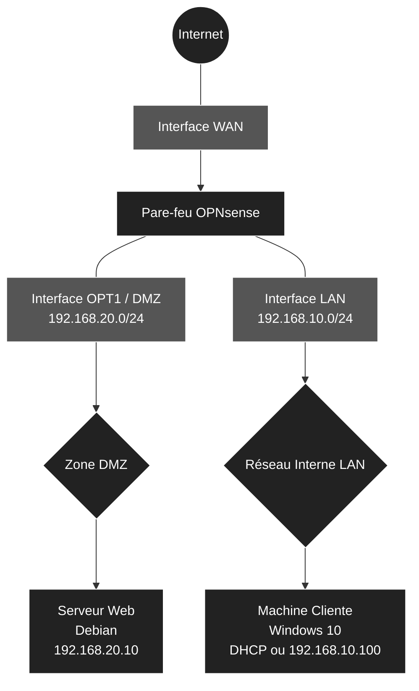

# 🛡️ Infrastructure Réseau, Sécurité et Segmentation

<br>

# 1. Architecture et Adressage IP

<br>

## 1.1 Schéma d'Architecture
Voici l'architecture logique de notre infrastructure, séparée en deux zones distinctes (LAN et DMZ) pour isoler le serveur Web accessible depuis l'extérieur.



<br>

## 1.2 Plan d'Adressage IP et Dimensionnement

<br>

| Rôle VM | Système | vCPU | RAM | Disque | Interfaces | Réseaux Virtuels | Adresses IP |
| :--- | :--- | :---: | :---: | :---: | :--- | :--- | :--- |
| **Pare-feu** | OPNsense | 1 | 1-2 Go | 20 Go | WAN (em0), LAN (em1), DMZ (em2) | **VMnet8** (NAT), **VMnet10** (Host-only), **VMnet20** (Host-only) | DHCP, `192.168.10.1/24`, `192.168.20.1/24` |
| **Serveur Web** | Debian 13 | 1 | 1-2 Go | 25 Go | eth0 | **VMnet20** (DMZ) | `192.168.20.10/24` (Statique) |
| **Client** | Windows 10 | 4 | 4-6 Go | 40 Go | Ethernet0 | **VMnet10** (LAN) | DHCP OPNsense (`192.168.10.x`) |

<br>

# 📋 Plan de Déploiement : Infrastructure Réseau et Sécurité sous VMware

Ce document détaille les étapes de construction de l'infrastructure virtuelle comprenant un pare-feu (OPNsense), un réseau interne (LAN) avec un poste client, et une zone démilitarisée (DMZ) hébergeant un serveur Web.

<br>

## 🛠️ Phase 1 : Préparation des réseaux virtuels (Virtual Network Editor)

La toute première étape consiste à préparer le "câblage" virtuel dans VMware avant même de créer les machines.
- **WAN (VMnet8 - NAT) :** Vérification du réseau par défaut permettant au pare-feu d'accéder à Internet.
- **LAN (VMnet10 - Host-only) :** Création du commutateur virtuel pour le réseau interne, en désactivant le DHCP natif de VMware (car OPNsense s'en chargera).
- **DMZ (VMnet20 - Host-only) :** Création du commutateur virtuel pour la zone publique isolée, en désactivant également le DHCP de VMware.

<br>

## 🖥️ Phase 2 : Création des Machines Virtuelles (Coquilles vides)

Paramétrage des trois machines selon le tableau de dimensionnement défini dans l'architecture.
- **Pare-feu OPNsense :** 1 vCPU, 2 Go RAM, 20 Go Disque. Ajout strict des 3 cartes réseau dans le bon ordre pour simplifier la configuration : WAN (VMnet8) en premier, LAN (VMnet10) en deuxième, DMZ (VMnet20) en troisième.
- **Serveur Web (Debian 13) :** 1 vCPU, 2 Go RAM, 25 Go Disque. Ajout d'une seule carte réseau assignée à la DMZ (VMnet20).
- **Client (Windows 10) :** 4 vCPU, 6 Go RAM, 40 Go Disque. Ajout d'une seule carte réseau assignée au LAN (VMnet10).

<br>

## 🔥 Phase 3 : Installation et Configuration initiale d'OPNsense (Console)

Déploiement du routeur central de l'infrastructure.
- Installation de l'OS OPNsense depuis l'ISO.
- Assignation des interfaces physiques virtuelles (`em0`, `em1`, `em2`) à leurs rôles respectifs (WAN, LAN, OPT1/DMZ).
- Configuration des adresses IP statiques depuis la console pour le LAN (`192.168.10.1/24`) et la DMZ (`192.168.20.1/24`).
- Activation du serveur DHCP sur l'interface LAN pour distribuer des IP aux futurs clients.

<br>

## 💻 Phase 4 : Déploiement de la Machine Cliente (Windows 10)

Mise en place du poste utilisateur dans le réseau interne, qui servira aussi de poste d'administration.
- Installation de Windows 10.
- Vérification de la bonne récupération de l'adresse IP (`192.168.10.x`) via le DHCP d'OPNsense.
- Accès à l'interface graphique web (WebGUI) d'OPNsense depuis le navigateur du client.

<br>

## 🌐 Phase 5 : Déploiement du Serveur Web (Debian 12)

Mise en place du serveur dans la zone isolée.
- Installation de Debian 13 (sans interface graphique pour des raisons de performances).
- Configuration réseau en IP statique (`192.168.20.10`, passerelle `192.168.20.1`, DNS).
- Installation du service Web (Nginx ou Apache) et création d'une page d'accueil HTML personnalisée de test.

<br>

## 🛡️ Phase 6 : Règles de Pare-feu et Routage (Interface Web OPNsense)

Sécurisation des flux réseau depuis l'interface graphique d'OPNsense.
- **Règles LAN :** Autoriser le réseau interne à accéder à Internet et à la DMZ.
- **Règles DMZ :** Isoler le serveur Web (bloquer les connexions initiées depuis la DMZ vers le LAN, mais autoriser l'accès à Internet pour les mises à jour Debian).
- **NAT (Port Forwarding) :** Rediriger le trafic entrant (depuis le réseau WAN) sur le port 80 vers l'IP du serveur Debian (`192.168.20.10`) pour simuler un accès depuis l'extérieur.

<br>

## ✅ Phase 7 : Tests de validation finaux

Vérification de la conformité et de l'étanchéité de l'architecture.
- **Test d'accès :** Accès à la page web de la Debian depuis le client Windows (doit réussir).
- **Test d'isolation :** Ping depuis la machine Debian vers la machine Windows (doit être bloqué par les règles de la DMZ).
- **Test d'accès externe (NAT) :** Accès au serveur Web depuis la machine hôte physique via l'IP WAN d'OPNsense.

<br>

## 🛠️ Phase 1 : Préparation des réseaux virtuels (VMware)

Avant de créer les machines virtuelles, il est nécessaire de configurer les commutateurs virtuels (Virtual Switches) qui relieront les différentes zones. Dans VMware Workstation, cela s'effectue via le **Virtual Network Editor**.

<br>

### 1. Ouverture du Virtual Network Editor

1. Lancer **VMware Workstation**.
2. Dans le menu supérieur, cliquer sur **Edit** > **Virtual Network Editor...**.
3. *Important :* Si les paramètres sont grisés, cliquer sur le bouton **Change Settings** en bas à droite (l'icône avec le bouclier Administrateur) et valider l'invite de contrôle de compte d'utilisateur de Windows.

<br>

### 2. Vérification du réseau WAN (VMnet8)

Ce réseau est présent par défaut ; il permettra au pare-feu OPNsense d'accéder à Internet.

1. Dans la liste des réseaux, repérer **VMnet8**.
2. Vérifier que la colonne *Type* indique bien **NAT**.
3. S'assurer que les cases **Connect a host virtual adapter to this network** et **Use local DHCP service to distribute IP address to VMs** sont **cochées**.
4. Laisser le *Subnet IP* par défaut (il peut varier selon l'installation VMware, cela n'a pas d'incidence).

<br>

### 3. Création du réseau LAN (VMnet10)

Il s'agit de créer le réseau interne pour le client Windows. Ce réseau doit être isolé. OPNsense distribuera les adresses IP, il est donc impératif de désactiver le DHCP natif de VMware.

1. Cliquer sur le bouton **Add Network...** en bas à droite.
2. Dans le menu déroulant, choisir **VMnet10** et cliquer sur **OK**.
3. Sélectionner **VMnet10** dans la liste, puis le configurer de la manière suivante :
   - **Type :** Sélectionner **Host-only** (Connect VMs internally in a private network).
   - **Connect a host virtual adapter... :** Laisser la case cochée (cela permet au PC physique de communiquer avec le LAN).
   - **Use local DHCP service... :** ❌ **DÉCOCHER IMPÉRATIVEMENT CETTE CASE** (OPNsense fera office de serveur DHCP).
   - **Subnet IP :** Saisir `192.168.10.0`
   - **Subnet mask :** Saisir `255.255.255.0`

<br>

### 4. Création du réseau DMZ (VMnet20)

Création de la zone publique isolée destinée au serveur Web Debian.

1. Cliquer à nouveau sur **Add Network...**.
2. Choisir **VMnet20** et cliquer sur **OK**.
3. Sélectionner **VMnet20** dans la liste, puis le configurer :
   - **Type :** Sélectionner **Host-only**.
   - **Connect a host virtual adapter... :** Laisser la case cochée.
   - **Use local DHCP service... :** ❌ **DÉCOCHER IMPÉRATIVEMENT CETTE CASE** (le serveur Web disposera d'une IP statique).
   - **Subnet IP :** Saisir `192.168.20.0`
   - **Subnet mask :** Saisir `255.255.255.0`

<br>

### 5. Validation

1. Cliquer sur le bouton **Apply** en bas à droite (VMware va redémarrer ses services réseau, cette opération prend quelques secondes).
2. Cliquer sur **OK** pour fermer la fenêtre.

L'infrastructure réseau virtuelle est désormais prête.

<br>

## 🖥️ Phase 2 : Création des Machines Virtuelles

Au cours de cette étape, les trois machines virtuelles seront créées. Pour OPNsense et Windows, la détection automatique de l'ISO sera utilisée. Pour Debian, en raison d'une limitation de l'assistant, la machine sera créée "à vide" avant d'y lier l'ISO. **Attention : ne démarrer aucune VM à la fin de l'assistant**, il convient d'abord d'ajuster le matériel et les cartes réseau.

<br>

### 1. Création de la VM Pare-feu (OPNsense)

1. Dans VMware, cliquer sur **File** > **New Virtual Machine...** > **Typical (recommended)**.
2. Choisir **Installer disc image file (iso)** et pointer vers le fichier ISO d'OPNsense (VMware détectera FreeBSD).
3. **Name :** Nommer la machine `OPNsense-Firewall`.
4. **Disk :** Saisir **20 GB** (*Store virtual disk as a single file*).
5. **Ready to Create :** ❌ **Décocher la case "Power on this virtual machine after creation"** puis cliquer sur **Finish**.

**Configuration stricte du matériel et des cartes réseau :**
Faire un clic droit sur la VM `OPNsense-Firewall` > **Settings...**
- **Mémoire (RAM) :** Ajuster à `2048` MB (2 Go).
- **Processeurs :** Ajuster à `1`.
- **Réseau 1 (WAN) :** Sélectionner la carte `Network Adapter` existante et vérifier qu'elle est configurée sur **NAT (VMnet8)**.
- **Réseau 2 (LAN) :** Cliquer sur **Add...** > **Network Adapter** > **Finish**. Sélectionner cette deuxième carte, cocher **Custom: Specific virtual network** > choisir **VMnet10**.
- **Réseau 3 (DMZ) :** Cliquer sur **Add...** > **Network Adapter** > **Finish**. Sélectionner cette troisième carte, cocher **Custom: Specific virtual network** > choisir **VMnet20**.
- Cliquer sur **OK**.

<br>

### 2. Création de la VM Serveur Web (Debian 12/13)

Cette machine sera isolée dans la zone démilitarisée (DMZ). L'ISO n'étant pas reconnu nativement par l'assistant, la configuration se fera manuellement.

1. Relancer l'assistant : **File** > **New Virtual Machine...** > **Typical (recommended)**.
2. Choisir **I will install the operating system later** et cliquer sur **Next**.
3. **Guest Operating System :** Choisir **Linux**, puis dans la liste déroulante, sélectionner **Debian 12.x 64-bit** (ou Debian 13.x 64-bit si disponible).
4. **Name :** Nommer la machine `Serveur-Web-Debian`.
5. **Disk :** Saisir **25 GB** (*Store virtual disk as a single file*). Cliquer sur **Next** puis sur **Finish**.

**Configuration du matériel, du réseau DMZ et de l'ISO :**
Faire un clic droit sur la VM `Serveur-Web-Debian` > **Settings...**
- **Mémoire (RAM) :** Ajuster à `2048` MB (2 Go).
- **Processeurs :** Ajuster à `1`.
- **Réseau (DMZ) :** Sélectionner la carte `Network Adapter`, cocher **Custom: Specific virtual network** > choisir **VMnet20**.
- **CD/DVD (IDE) :** Sélectionner ce composant, cocher **Use ISO image file**, cliquer sur **Browse...** et pointer vers le fichier ISO Debian.
- Cliquer sur **OK**.

<br>

### 3. Création de la VM Client (Windows 10)

Cette machine sera déployée dans le réseau interne (LAN).

1. Relancer l'assistant : **File** > **New Virtual Machine...** > **Typical (recommended)**.
2. Choisir **Installer disc image file (iso)** et pointer vers l'ISO de Windows 10.
3. Aucune clé d'activation ni mot de passe ne sont requis à cette étape ; il suffit de sélectionner la version Windows 10 Pro et de saisir un nom.
4. **Name :** Nommer la machine `Client-Windows10`.
5. **Disk :** Saisir **60 GB** (*Store virtual disk as a single file*).
6. **Ready to Create :** ❌ **Décocher la case "Power on this virtual machine after creation"** puis cliquer sur **Finish**.

**Configuration du matériel et du réseau LAN :**
Faire un clic droit sur la VM `Client-Windows10` > **Settings...**
- **Mémoire (RAM) :** Ajuster à `6144` MB (6 Go).
- **Processeurs :** Ajuster à `4`.
- **Réseau (LAN) :** Sélectionner la carte `Network Adapter`, cocher **Custom: Specific virtual network** > choisir **VMnet10**.
- Cliquer sur **OK**.

<br>

## 🔥 Phase 3 : Installation et Configuration initiale d'OPNsense (Console)

Il est temps de mettre en service le routeur central. L'installation du système d'exploitation OPNsense sera effectuée sur la machine virtuelle, suivie de l'attribution des adresses IP de base pour le LAN et la DMZ en ligne de commande.

<br>

### 1. Installation du système OPNsense

1. Dans VMware, sélectionner la VM `OPNsense-Firewall` et cliquer sur **Power on this virtual machine**.
2. Laisser le système démarrer (des lignes de texte vont défiler) jusqu'à l'apparition de l'invite de connexion (`login:`).
3. Se connecter avec les identifiants par défaut du LiveCD :
   - **Login :** `installer`
   - **Password :** `opnsense` *(Attention, le clavier est en QWERTY par défaut, il faudra donc taper `opnsense` en tenant compte de la disposition des touches)*.
4. L'assistant d'installation s'ouvre (utiliser les flèches directionnelles et la touche Entrée pour naviguer) :
   - **Keymap :** Laisser sur *Accept these Settings* (ou chercher `fr.kbd` pour le clavier AZERTY).
   - **Task :** Choisir **Install (UFS)** et valider.
   - **Disk :** Sélectionner le disque virtuel (généralement nommé `da0` ou `vtbd0`) et valider par **YES** pour effacer les données.
   - Laisser l'installation se terminer (environ 2 à 3 minutes).
5. À la fin du processus, l'assistant propose de redémarrer (Reboot). **Avant de valider**, il est impératif d'éjecter l'ISO pour éviter de relancer l'installation : 
   - Faire un clic droit sur l'onglet de la VM OPNsense en haut de l'écran > **Settings** > **CD/DVD** > décocher **Connect at power on**. Cliquer sur **OK**.
6. Valider ensuite le **Reboot** dans la console OPNsense.

<br>

### 2. Assignation des cartes réseau

Après le redémarrage, OPNsense affiche un menu de configuration (options 0 à 13) ainsi que l'assignation actuelle des cartes réseau. Par défaut, FreeBSD nomme les cartes `em0`, `em1` et `em2`. Il faut s'assurer de leur bon ordre.

1. Se connecter avec les identifiants root fraîchement installés :
   - **Login :** `root`
   - **Password :** `opnsense`
2. Taper l'option **1** (Assign Interfaces) et valider avec la touche Entrée :
   - *Do you want to configure LAGGs?* -> Taper **N** et valider.
   - *Do you want to configure VLANs?* -> Taper **N** et valider.
   - *Enter the WAN interface name:* -> Taper `em0`.
   - *Enter the LAN interface name:* -> Taper `em1`.
   - *Enter the Optional 1 interface name:* -> Taper `em2` (Il s'agit de la DMZ).
   - Laisser vide la ligne suivante et appuyer sur **Entrée** pour terminer l'assignation.
   - *Do you want to proceed?* -> Taper **y** (Yes).

<br>

### 3. Configuration des adresses IP (LAN et DMZ)

Le système va recharger les interfaces. Il convient maintenant d'appliquer le plan d'adressage IP.

**A. Configuration du LAN (VMnet10) :**
1. Dans le menu principal, taper l'option **2** (Set interface IP address).
2. Sélectionner l'interface **LAN** (taper le numéro correspondant, généralement `2`).
3. *Configure IPv4 address LAN interface via DHCP?* -> **n** (Non).
4. *Enter the new LAN IPv4 address:* -> Taper `192.168.10.1`
5. *Enter the new LAN IPv4 subnet bit count:* -> Taper `24`
6. *For a WAN, enter the new LAN IPv4 upstream gateway...* -> Appuyer simplement sur **Entrée** (laisser vide pour le LAN).
7. *Configure IPv6 address LAN interface via DHCP6?* -> **n** (Appuyer sur Entrée pour ignorer la configuration IPv6).
8. *Do you want to enable the DHCP server on LAN?* -> **y** (Oui).
9. *Enter the start address of the IPv4 client address range:* -> Taper `192.168.10.100`
10. *Enter the end address:* -> Taper `192.168.10.150`
11. *Do you want to change the web GUI protocol from HTTPS to HTTP?* -> **n** (Non, conserver le HTTPS sécurisé).

**B. Configuration de la DMZ (OPT1 - VMnet20) :**
1. De retour au menu principal, taper à nouveau l'option **2** (Set interface IP address).
2. Sélectionner l'interface **OPT1** (généralement `3`).
3. *Configure IPv4 address OPT1 interface via DHCP?* -> **n**.
4. *Enter the new OPT1 IPv4 address:* -> Taper `192.168.20.1`
5. *Enter the new OPT1 IPv4 subnet bit count:* -> Taper `24`
6. *Gateway:* -> Appuyer sur **Entrée**.
7. *IPv6:* -> Taper **n** puis Entrée pour ignorer.
8. *Do you want to enable the DHCP server on OPT1?* -> **n** (Non, le serveur Debian sera configuré en IP statique).

Laisser le routeur appliquer les paramètres. L'en-tête du menu doit maintenant afficher :
- **WAN** (em0) : *Une adresse IP distribuée par le NAT de VMware (ex: 192.168.x.x)*
- **LAN** (em1) : `192.168.10.1/24`
- **OPT1** (em2) : `192.168.20.1/24`

<br>

## 💻 Phase 4 : Déploiement du Client (Windows 10) et Accès Web OPNsense

Cette machine, située dans le réseau interne (LAN), obtiendra une adresse IP automatiquement via le pare-feu et servira de poste d'administration graphique.

<br>

### 1. Installation de Windows 10

1. Dans VMware, sélectionner la VM `Client-Windows10` et cliquer sur **Power on this virtual machine**.
2. Appuyer sur n'importe quelle touche au démarrage pour booter sur l'ISO.
3. Suivre l'assistant d'installation standard de Windows :
   - Choisir **Je n'ai pas de clé de produit**.
   - Sélectionner **Windows 10 Pro**.
   - Choisir l'installation **Personnalisée** et sélectionner le disque de 40 Go.
4. Lors de la configuration initiale (OOBE), sélectionner une configuration pour un usage personnel et créer un compte local hors ligne (sans compte Microsoft) afin de gagner du temps.

<br>

### 2. Vérification de l'adressage IP (DHCP)

Une fois sur le bureau Windows, il faut s'assurer que la machine communique bien avec OPNsense.

1. Faire un clic droit sur le bouton Démarrer de Windows > **Windows PowerShell** (ou Invite de commandes).
2. Taper la commande `ipconfig` et valider avec la touche Entrée.
3. Vérifier les informations de la carte Ethernet (qui correspond au VMnet10) :
   - **Adresse IPv4 :** Une adresse IP dans la plage définie à la Phase 3 doit être présente (par exemple `192.168.10.100`).
   - **Passerelle par défaut :** L'adresse IP du pare-feu `192.168.10.1` doit s'afficher.
   - *Test optionnel :* Taper `ping 8.8.8.8` pour vérifier que le client a bien accès à Internet via OPNsense.

<br>

### 3. Premier accès à l'interface Web d'OPNsense (WebGUI)

La machine cliente étant correctement configurée sur le LAN, elle peut désormais administrer le pare-feu.

1. Ouvrir le navigateur Microsoft Edge sur la machine Windows 10.
2. Dans la barre d'adresse, saisir `https://192.168.10.1` et appuyer sur Entrée.
3. Un avertissement de sécurité va s'afficher car le certificat SSL est auto-signé. Cliquer sur **Paramètres avancés** (ou *Advanced*), puis sur **Continuer vers 192.168.10.1 (dangereux)**.
4. Se connecter avec les identifiants par défaut définis à la Phase 3 :
   - **Utilisateur :** `root`
   - **Mot de passe :** `opnsense` (ou le mot de passe modifié à la fin de l'installation).

<br>

### 4. Assistant de configuration initiale OPNsense (Wizard)

Un assistant de premier démarrage (*Wizard*) se lance automatiquement lors de la première connexion. Cliquer sur **Next** pour parcourir les étapes :

- **General Information :** 
  - *Hostname:* Laisser `OPNsense` (ou le modifier selon vos préférences).
  - *Domain:* Laisser `localdomain`.
  - *Primary DNS Server:* Saisir `8.8.8.8` (ou laisser vide pour hériter de la configuration du réseau NAT de VMware).
  - **Configuration DNS (selon les besoins) :**
    - Cocher la case **Override DNS**.
    - Sous la section *DNS [Unbound]*, cocher la case **Enable Resolver**.
    - S'assurer que les cases **Enable DNSSEC Support** et **Harden DNSSEC data** sont décochées.
    - Cliquer sur **Next**.
- **Time Server :** Sélectionner le fuseau horaire (ex: `Europe/Paris`).
- **Network [WAN] :**
  - *Type :* Laisser sur **DHCP**.
  - *Default policies :*
    - ❌ **Block RFC1918 Private Networks :** **DÉCOCHER IMPÉRATIVEMENT** cette case. L'interface WAN est reliée au NAT VMware (`VMnet8`), qui utilise un adressage privé. Si cette option reste active, OPNsense rejettera les paquets du réseau local physique et bloquera les redirections de ports (NAT).
    - ❌ **Block bogon networks :** **DÉCOCHER** également cette case pour éviter les blocages de plages réservées dans le cadre d'un laboratoire virtuel.
  - Cliquer sur **Next**.
- **Network [LAN] :**
  - Vérifier que l'adresse IP est bien `192.168.10.1/24`.
  - ✅ **Configure DHCP server :** **LAISSER CETTE CASE COCHÉE**.
    - *Pourquoi ?* Lors de la Phase 1, le service DHCP interne de VMware sur le commutateur `VMnet10` a été volontairement désactivé. C'est OPNsense qui assure ce rôle en distribuant dynamiquement les adresses IP, le masque, la passerelle et le serveur DNS à la machine Windows 10. Si cette option est décochée, le poste Windows perdra son bail d'adressage et n'aura plus d'accès au réseau sans une configuration manuelle.
  - Cliquer sur **Next**
- **Deployment type :**
  - ❌ **Optimize for Multiwan :** **DÉCOCHER** la case. L'infrastructure ne disposant que d'un seul lien WAN (`VMnet8`), cette optimisation n'est utile que pour l'agrégation de plusieurs accès Internet.
  - ✅ **Automatic DHCP/DNS registration :** **LAISSER COCHÉ**. Cela permet au résolveur DNS local (Unbound) de résoudre automatiquement les noms des machines clientes du LAN.
  - ❌ **Optimize for IPsec :** **LAISSER DÉCOCHÉ**. Aucun tunnel VPN IPsec n'est requis ici.
  - Cliquer sur **Next**
- **Set Root Password :**
  - Définir un nouveau mot de passe administrateur pour sécuriser l'accès.
- **Reload Configuration :**
  - Cliquer sur **Reload** pour appliquer l'ensemble des paramètres.

> ⚠️ **Avertissement – Perte de connectivité après la mise en veille de l'hôte :**
> 
> Si l'ordinateur physique se met en veille, Windows suspend les adaptateurs réseau virtuels et le service NAT de VMware peut se figer au réveil du système.
> 
> * **Symptôme :** OPNsense perd l'accès à Internet, les mises à jour échouent et la passerelle NAT (`192.168.38.2`) ne répond plus aux pings (`Host is down`).
> * **Résolution :** Sur la machine hôte Windows, ouvrir la fenêtre Exécuter (**Windows + R**), saisir `services.msc` et redémarrer les services **VMware NAT Service** et **VMware DHCP Service**. La connectivité sera rétablie immédiatement.

## 🌐 Phase 5 : Déploiement du Serveur Web (Debian 13)

L'installation du serveur Web va maintenant se dérouler dans la zone isolée (DMZ). Avant de démarrer l'installation, il est nécessaire d'autoriser cette zone à accéder à Internet afin de pouvoir télécharger les paquets requis (comme Nginx).

<br>

### 1. Prérequis : Autoriser l'accès Internet pour la DMZ (depuis Windows 10)

1. Retourner sur le **Client Windows 10** et ouvrir l'interface Web d'OPNsense.
2. Dans le menu latéral gauche, naviguer vers **Firewall** > **Rules** > **OPT1** (la DMZ).
3. Cliquer sur le bouton orange **+ (Add)** en haut à droite pour créer une règle :
   - **Action :** Pass
   - **Interface :** OPT1
   - **Direction :** in
   - **Protocol :** any
   - **Source :** OPT1 net
   - **Destination :** any
   - **Description :** Accès Internet temporaire DMZ (installation Debian)
4. Cliquer sur **Save** en bas de page, puis sur **Apply Changes**.
   *(Remarque : Les interfaces optionnelles (OPT) d'OPNsense sont soumises à une règle de blocage total "Deny All" par défaut. Cette règle permissive temporaire permet à la machine Debian de se connecter à Internet pour s'installer et se mettre à jour. Cette règle sera restreinte lors de la Phase 6).*

<br>

### 2. Installation de l'OS Debian 13

1. Dans VMware, sélectionner la VM `Serveur-Web-Debian` et cliquer sur **Power on this virtual machine**.
2. Dans le menu de démarrage, choisir **Install** (l'installation classique en mode texte, recommandée pour les serveurs).
3. Sélectionner les préférences de langue (Français) et de clavier.
4. **Configuration du réseau (Étape cruciale) :**
   - L'installateur va tenter de configurer le réseau via DHCP. **Cette tentative va échouer** (et c'est normal, le DHCP étant désactivé sur la DMZ).
   - Cliquer sur **Continuer** puis choisir **Configurer le réseau manuellement**.
   - **Adresse IP :** Saisir `192.168.20.10`
   - **Masque de sous-réseau :** Laisser `255.255.255.0`
   - **Passerelle :** Saisir `192.168.20.1` (l'adresse IP du pare-feu OPNsense côté DMZ).
   - **Serveurs de noms (DNS) :** Saisir `8.8.8.8` (ou l'IP de la DMZ d'OPNsense).
   - **Nom d'hôte :** Laisser `serveur-web` (ou `debian`).
5. Configurer les mots de passe (root) et créer le compte utilisateur standard.
6. **Partitionnement des disques :** Choisir *Assisté - utiliser un disque entier*, valider les choix par défaut et accepter d'appliquer les changements sur les disques.
7. **Sélection des logiciels (Tasksel) :**
   - ❌ **DÉCOCHER** *Environnement de bureau Debian* et *GNOME* (utiliser la barre d'espace pour décocher). Un serveur n'a pas besoin d'interface graphique ; cela consomme inutilement de la RAM et des ressources processeur.
   - ✅ **COCHER** uniquement *Serveur SSH* et *Utilitaires standard du système*.
8. Laisser l'installation se terminer et accepter d'installer le chargeur de démarrage GRUB sur le disque principal (`/dev/sda`). La machine virtuelle va redémarrer.

<br>

### 3. Installation et configuration du service Web (Nginx)

Une fois Debian redémarré, une invite de commande (`login:`) s'affiche à l'écran.

1. Se connecter avec l'identifiant `root` et le mot de passe défini lors de l'installation.
2. Vérifier que la machine a bien accès à Internet (grâce à la règle OPNsense créée à l'étape 1) :
   ```bash
   ping -c 4 8.8.8.8
   ```
3. Mettre à jour la liste des paquets et installer le serveur Web Nginx :
   ```bash
   apt update && apt install nginx -y
   ```
4. Remplacer la page d'accueil par défaut de Nginx par une page personnalisée pour valider le fonctionnement :
   ```bash
   echo "<h1>Bienvenue sur la DMZ - Serveur Web (192.168.20.10)</h1>" > /var/www/html/index.html
   ```
5. Vérifier que le service Web s'exécute correctement :
   ```bash
   systemctl status nginx
   ```

## 🛡️ Phase 6 : Règles de Pare-feu et Redirection (NAT)

Le serveur Web étant opérationnel dans sa zone isolée, il convient d'affiner la sécurité de la DMZ et de mettre en place la redirection de port pour rendre le site accessible depuis l'extérieur.

### 1. Sécuriser la DMZ (Interface OPT1)

Une DMZ est autorisée à répondre aux requêtes et à accéder à Internet, mais il lui est **strictement interdit d'initier une connexion vers le réseau interne (LAN)**.

1. Depuis le client Windows 10, se rendre dans **Pare-feu > Règles > OPT1**.
2. Cliquer sur le bouton orange **+ (Ajouter)** pour créer une nouvelle règle de blocage :
   - **Action :** Bloquer (Block)
   - **Direction :** Entrée (in)
   - **Protocole :** any
   - **Source :** OPT1 net
   - **Destination :** LAN net
   - **Description :** Isoler la DMZ du LAN
3. Cliquer sur **Sauvegarder**.
4. ⚠️ **Important :** Dans la liste des règles, cette règle de blocage (signalée par une icône rouge) doit impérativement se trouver **AU-DESSUS** de la règle d'autorisation "Pass All" (icône verte) créée lors de la Phase 5.
5. Cliquer sur **Appliquer les changements**.

### 2. Prérequis NAT : Libérer le port 80 du pare-feu

Par défaut, OPNsense écoute sur le port 80 pour rediriger automatiquement les requêtes d'administration vers son interface sécurisée (HTTPS/443). Il est impératif de désactiver cette interception pour que la redirection vers le serveur web fonctionne correctement.

1. Naviguer vers **Système > Paramètres > Administration**.
2. Dans la section *Interface Web*, cocher la case **Désactiver la règle de redirection de l'interface graphique Web**.
3. Descendre en bas de la page et cliquer sur **Sauvegarder**.

### 3. Redirection de port (Port Forwarding / NAT)

Cette étape simule un accès depuis Internet. Tout le trafic HTTP arrivant sur l'interface WAN du pare-feu sera redirigé de manière transparente vers le serveur Debian.

1. Se rendre dans **Pare-feu > NAT > Redirection de port**.
2. Cliquer sur le bouton orange **+ (Ajouter)** :
   - **Interface :** WAN
   - **Protocole :** TCP
   - **Destination :** WAN address
   - **Plage de ports de destination :** de `HTTP` à `HTTP`
   - **IP cible de redirection :** `192.168.20.10` (L'adresse du serveur Debian)
   - **Port cible de redirection :** `HTTP`
   - **Description :** NAT HTTP vers Serveur Web DMZ
   - **Firewall rule (sous la section Options) :** Sélectionner **Register rule**. Cette option est cruciale, elle instruit OPNsense de créer automatiquement la règle d'ouverture correspondante sur l'interface WAN.
3. Cliquer sur **Sauvegarder** puis sur **Appliquer les changements**.

> 💡 **Alternative : Création manuelle de la règle de pare-feu**
> Si l'option *Firewall rule* a été laissée sur **Manuel** lors de la création du NAT, la redirection ne fonctionnera pas car le pare-feu bloquera le trafic entrant. Il faut alors autoriser le trafic manuellement :
> 1. Aller dans **Pare-feu > Règles > WAN**.
> 2. Cliquer sur le bouton orange **+ (Ajouter)** :
>    - **Action :** Autoriser (Pass)
>    - **Interface :** WAN
>    - **Protocole :** TCP
>    - **Source :** any
>    - **Destination :** Hôte unique ou réseau -> Saisir `192.168.20.10`
>    - **Plage de ports de destination :** de `HTTP` à `HTTP`
>    - **Description :** Autoriser HTTP entrant vers DMZ (Manuel)
> 3. Cliquer sur **Sauvegarder** puis sur **Appliquer les changements**.

<br>

## ✅ Phase 7 : Tests de validation finaux

Le déploiement de l'infrastructure est terminé. Voici le plan de test permettant de valider l'étanchéité du réseau :

1. **Test d'accès Internet depuis le LAN :** 
   - Depuis le client Windows 10, lancer un ping vers `8.8.8.8` (doit réussir).
2. **Test d'accès au service exposé (LAN vers DMZ) :** 
   - Depuis Windows 10, ouvrir un navigateur web et saisir l'URL `http://192.168.20.10`. La page d'accueil Nginx doit s'afficher.
3. **Test d'isolation (Sécurité) :** 
   - Depuis la machine Debian en ligne de commande, tenter de "pinger" l'adresse IP du client Windows (`192.168.10.x`). **Ce test doit échouer**, le trafic étant bloqué par la règle définie en Phase 6.
4. **Test du NAT (Exposition Internet) :** 
   - Depuis la machine physique hôte, ouvrir un navigateur web et saisir l'adresse IP WAN attribuée à OPNsense (celle du réseau `VMnet8`). La page web du serveur Debian doit s'afficher, confirmant le bon fonctionnement de la redirection.
