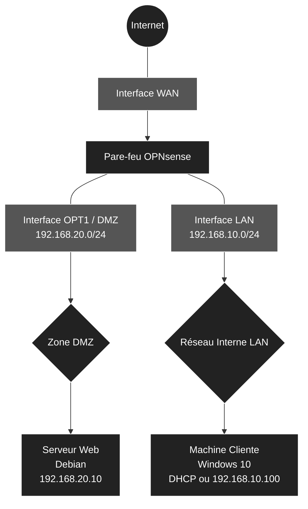

[ 🇫🇷 Français ] | [ 🇬🇧 English ](README_en.md)

# 🛡️ Infrastructure Réseau, Sécurité et Segmentation

 

## 📖 Contexte et Objectifs
Ce projet documente la conception et le déploiement d'une infrastructure réseau virtuelle segmentée, simulant un environnement d'entreprise. 
L'objectif principal est de protéger un réseau interne d'administration (LAN) tout en exposant publiquement un service Web isolé dans une zone démilitarisée (DMZ). Le routage, la distribution IP et la politique de sécurité (Zero Trust) sont centralisés sur un pare-feu **OPNsense**.

 

## 📐 Architecture Logique
L'infrastructure repose sur trois zones distinctes, isolées physiquement (via des commutateurs virtuels dédiés) et logiquement (via les règles du pare-feu).

 

 

## 🛠️ Logique de Sécurité et Technologies Implémentées
Ce laboratoire met en pratique plusieurs concepts fondamentaux de l'administration réseau et de la cybersécurité :

1. **Ségrégation Réseau (VMware) :** Création de commutateurs virtuels isolés (`VMnet10` pour le LAN et `VMnet20` pour la DMZ) en désactivant le DHCP de l'hyperviseur pour redonner le contrôle absolu au routeur OPNsense.
2. **Règles de Pare-feu (Isolation DMZ) :** La zone DMZ possède une interdiction stricte d'initier des connexions vers le réseau interne (Deny by default vers le LAN). Cela garantit l'étanchéité du réseau d'administration en cas de compromission du serveur Web exposé.
3. **Translation d'Adresses (NAT / Port Forwarding) :** Redirection invisible du trafic HTTP (Port 80) arrivant sur l'IP publique (WAN) vers le serveur Debian interne (`192.168.20.10`), avec génération automatique de la règle d'ouverture filtrée.
4. **Services Réseaux Locaux :** Déploiement d'un serveur DHCP sur l'interface LAN et paramétrage du résolveur DNS Unbound pour l'accès Internet des postes clients.

 

## 📊 Dimensionnement et Adressage IP

| Rôle VM | Système | vCPU | RAM | Disque | Interfaces | Réseaux Virtuels | Adresses IP |
| :--- | :--- | :---: | :---: | :---: | :--- | :--- | :--- |
| **Pare-feu** | OPNsense | 1 | 1-2 Go | 20 Go | WAN, LAN, DMZ | **VMnet8** (NAT), **VMnet10** (Host-only), **VMnet20** (Host-only) | DHCP, `192.168.10.1/24`, `192.168.20.1/24` |
| **Serveur Web** | Debian 12 | 1 | 1-2 Go | 25 Go | eth0 | **VMnet20** (DMZ) | `192.168.20.10/24` (Statique) |
| **Client** | Windows 10 | 4 | 4-6 Go | 40 Go | Ethernet0 | **VMnet10** (LAN) | DHCP OPNsense (`192.168.10.x`) |

 

## 🚀 Documentation et Déploiement
L'intégralité du processus de construction de ce laboratoire est détaillée dans un manuel opérationnel pas-à-pas (configuration initiale, interfaces en ligne de commande, règles de sécurité WebGUI, installation Nginx).

👉 **[Consulter le Guide de Déploiement complet (Tutoriel)](GUIDE_DEPLOIEMENT_fr.md)**
