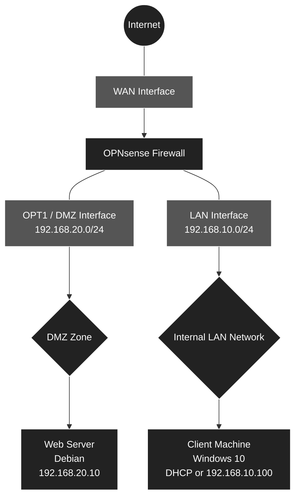

[ 🇫🇷 Français ](README.md) | [ 🇬🇧 English ]

# 🛡️ Network Infrastructure, Security, and Segmentation

 

## 📖 Context and Objectives
This project documents the design and deployment of a segmented virtual network infrastructure, simulating a corporate environment. 
The main objective is to protect an internal administration network (LAN) while publicly exposing an isolated Web service in a demilitarized zone (DMZ). Routing, IP distribution, and the security policy (Zero Trust) are centralized on an **OPNsense** firewall.

 

## 📐 Logical Architecture
The infrastructure is based on three distinct zones, physically isolated (via dedicated virtual switches) and logically isolated (via firewall rules).

 

 

## 🛠️ Security Logic and Implemented Technologies
This laboratory puts into practice several fundamental concepts of network administration and cybersecurity:

1. **Network Segregation (VMware):** Creation of isolated virtual switches (`VMnet10` for the LAN and `VMnet20` for the DMZ) by disabling the hypervisor's DHCP to give absolute control back to the OPNsense router.
2. **Firewall Rules (DMZ Isolation):** The DMZ zone has a strict prohibition on initiating connections to the internal network (Deny by default to the LAN). This guarantees the airtightness of the administration network in the event of a compromise of the exposed Web server.
3. **Network Address Translation (NAT / Port Forwarding):** Invisible redirection of HTTP traffic (Port 80) arriving on the public IP (WAN) to the internal Debian server (`192.168.20.10`), with automatic generation of the filtered opening rule.
4. **Local Network Services:** Deployment of a DHCP server on the LAN interface and configuration of the Unbound DNS resolver for client machines' Internet access.

 

## 📊 Sizing and IP Addressing

| VM Role | System | vCPU | RAM | Disk | Interfaces | Virtual Networks | IP Addresses |
| :--- | :--- | :---: | :---: | :---: | :--- | :--- | :--- |
| **Firewall** | OPNsense | 1 | 1-2 GB | 20 GB | WAN, LAN, DMZ | **VMnet8** (NAT), **VMnet10** (Host-only), **VMnet20** (Host-only) | DHCP, `192.168.10.1/24`, `192.168.20.1/24` |
| **Web Server** | Debian 12 | 1 | 1-2 GB | 25 GB | eth0 | **VMnet20** (DMZ) | `192.168.20.10/24` (Static) |
| **Client** | Windows 10 | 4 | 4-6 GB | 40 GB | Ethernet0 | **VMnet10** (LAN) | OPNsense DHCP (`192.168.10.x`) |

 

## 🚀 Documentation and Deployment
The entire process of building this laboratory is detailed in a step-by-step operational manual (initial configuration, command-line interfaces, WebGUI security rules, Nginx installation).

👉 **[Consult the full Deployment Guide (Tutorial)](DEPLOYMENT_GUIDE_en.md)**
